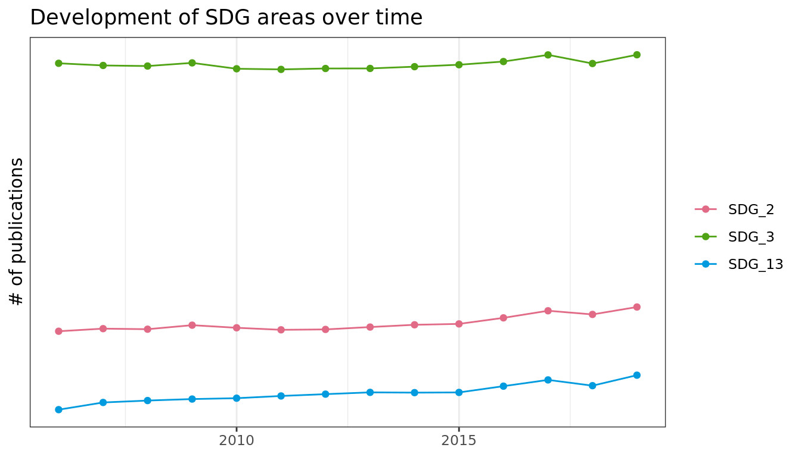
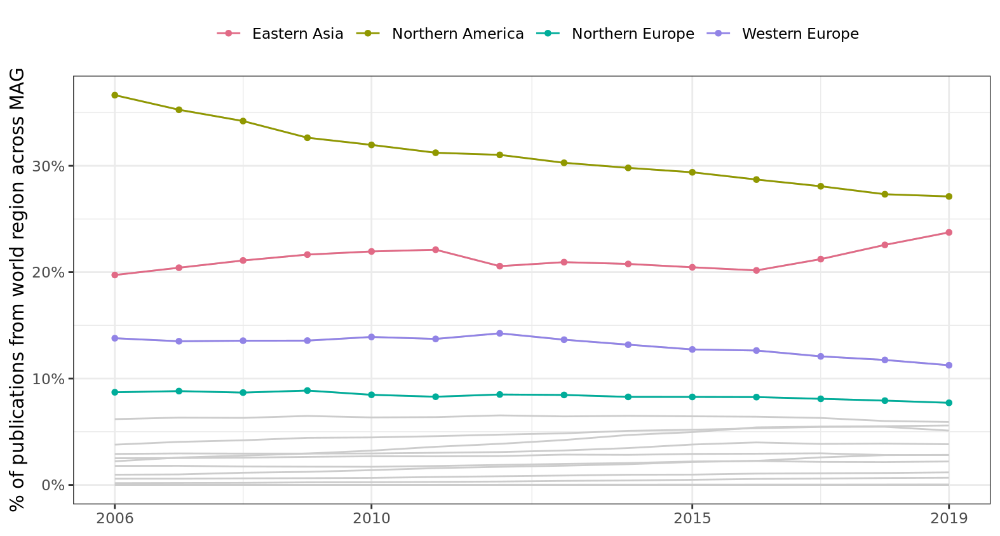
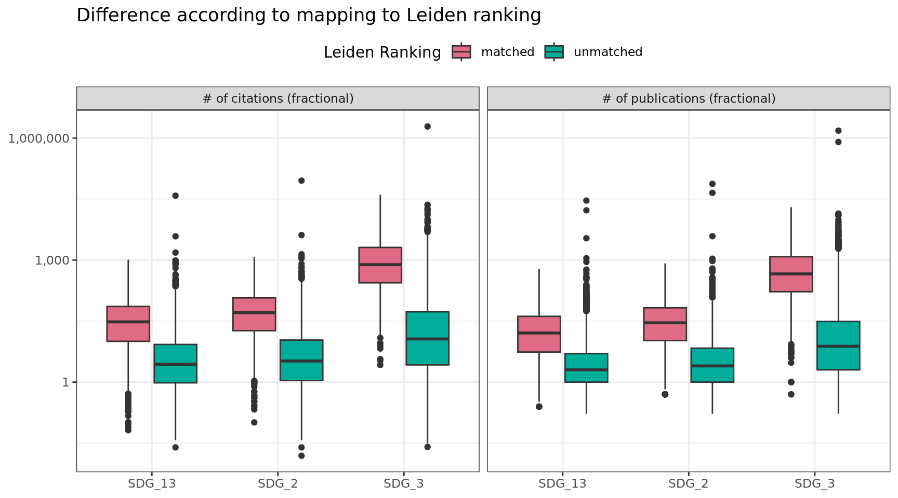
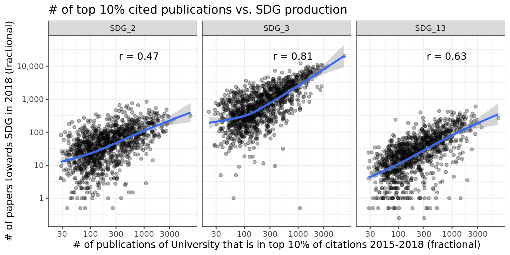
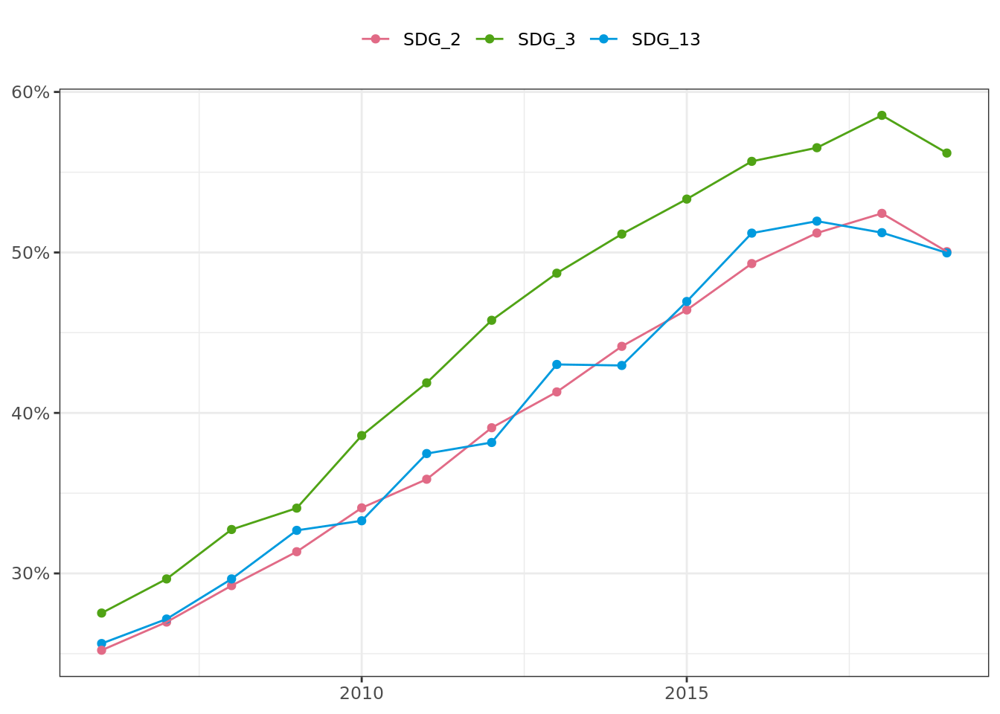
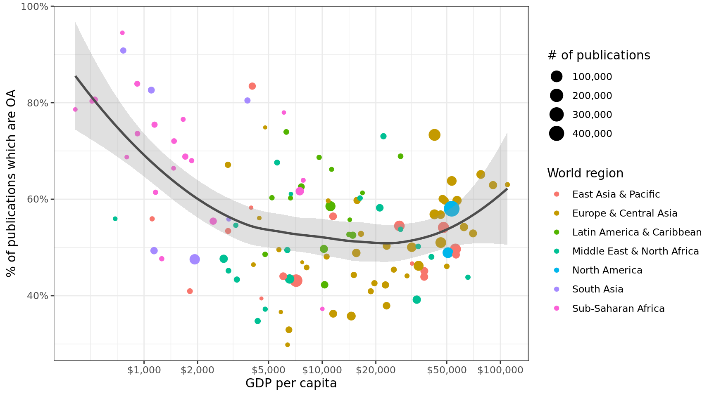
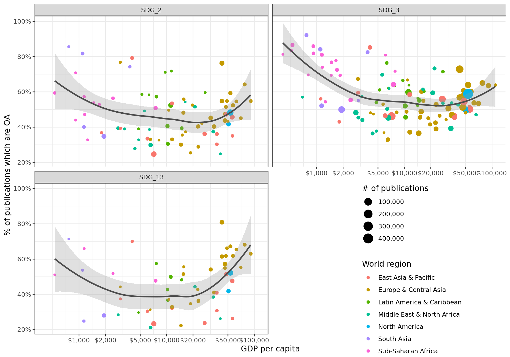

::: {.cell}

```{.r .cell-code}
library(sparklyr)
```

::: {.cell-output .cell-output-stderr}
```

Attaching package: 'sparklyr'
```
:::

::: {.cell-output .cell-output-stderr}
```
The following object is masked from 'package:stats':

    filter
```
:::

```{.r .cell-code}
library(ggplot2)
library(patchwork)
library(dplyr)
```

::: {.cell-output .cell-output-stderr}
```

Attaching package: 'dplyr'
```
:::

::: {.cell-output .cell-output-stderr}
```
The following objects are masked from 'package:stats':

    filter, lag
```
:::

::: {.cell-output .cell-output-stderr}
```
The following objects are masked from 'package:base':

    intersect, setdiff, setequal, union
```
:::

```{.r .cell-code}
library(arrow)
```

::: {.cell-output .cell-output-stderr}
```

Attaching package: 'arrow'
```
:::

::: {.cell-output .cell-output-stderr}
```
The following object is masked from 'package:utils':

    timestamp
```
:::

```{.r .cell-code}
library(here)
```

::: {.cell-output .cell-output-stderr}
```
here() starts at /home/tklebel/SDG/sdg_knowledge_production
```
:::

```{.r .cell-code}
library(tidyr)
library(forcats)
library(readr)
library(stringr)

theme_set(theme_bw())

source(here("R/helpers.R"))

Sys.setenv(SPARK_HOME = "/home/tklebel/spark-3.4.0-bin-hadoop3/")
Sys.setenv(HADOOP_HOME = "/home/hadoop/hadoop-3.3.1")
Sys.setenv(HADOOP_CONF_DIR = "/home/hadoop/hadoop-3.3.1/etc/hadoop")
Sys.setenv(YARN_HOME = "/home/hadoop/hadoop-3.3.1")
Sys.setenv(YARN_CONF_DIR = "/home/hadoop/hadoop-3.3.1/etc/hadoop")
Sys.setenv(JAVA_HOME="/usr/lib/jvm/java-1.11.0-openjdk-amd64")

config <- spark_config()
config$spark.executor.cores <- 5
config$spark.executor.instances <- 38
config$spark.executor.memory <- "20G"
config$spark.hadoop.mapreduce.fileoutputcommitter.algorithm.version <- 2

sc <- spark_connect(master = "yarn", config = config,
                    app_name = "SDG-knowledge-production")

message("Connection to Spark successful!")
```

::: {.cell-output .cell-output-stderr}
```
Connection to Spark successful!
```
:::

```{.r .cell-code}
message("Reading the datasets...")
```

::: {.cell-output .cell-output-stderr}
```
Reading the datasets...
```
:::

```{.r .cell-code}
# Overall MAG data
paper_cols <- c("paperid", "rank", "doi", "type", "title_normalised", "title", 
                "unknown1", "year", "date", "unknown2", "publisher", 
                paste0("unknown", 3:12),
                "journal", paste0("unknown", c(14:16)))

mag_2021_papers <- spark_read_csv(sc, "/tklebel/mag-2021-03-15/Papers.txt",
                                  name = "mag2021_papers",
                                  memory = FALSE,
                                  delimiter = "\\t", header = FALSE,
                                  columns = paper_cols)

affil_cols <- c("paperid", "authorid", "affiliationid", "authorsequencenumber",
                "originalauthor", "originalaffiliation")

mag_2021_paper_author_affil <- spark_read_csv(
  sc, 
  "/tklebel/mag-2021-03-15/PaperAuthorAffiliations.txt",
  name = "mag2021_paper_author_affil", delimiter = "\\t",
  memory = FALSE, header = FALSE, columns = affil_cols)

# this is data to fill in country information where we do not have it from the
# SDG set
missing_country_data <- spark_read_csv(
  sc,
  "/tklebel/SDG/additional_country_information.csv",
  name = "missing_country_data"
)

# SDG specific data
papers <- spark_read_csv(sc, "/tklebel/SDG/sdg_papers_collated.csv",
                         name = "papers")
sdg_labels <- spark_read_csv(sc, "/tklebel/SDG/sdg_labels.csv",
                             name = "sdg_labels")
# join the labels here, since we are doing everything by SDG
papers <- papers %>% 
  left_join(sdg_labels)
```

::: {.cell-output .cell-output-stderr}
```
Joining with `by = join_by(paperid)`
```
:::

```{.r .cell-code}
# remove 2020
papers <- papers %>% 
  filter(year < 2020)

# Affiliations
affils <- spark_read_csv(sc,
                         "/tklebel/SDG/affiliations_with_country_code.csv",
                         name = "affils")

author_paper_affiliations <- spark_read_csv(
  sc,
  "/tklebel/SDG/sdg_author_paper_affil.csv",
  name = "author_paper_affiliations"
)

# UN country information
un_countries <- read_csv2(here::here("data/external/UNSD — Methodology.csv"))
```

::: {.cell-output .cell-output-stderr}
```
ℹ Using "','" as decimal and "'.'" as grouping mark. Use `read_delim()` for more control.
```
:::

::: {.cell-output .cell-output-stderr}
```
Rows: 248 Columns: 15
── Column specification ────────────────────────────────────────────────────────
Delimiter: ";"
chr (15): Global Code, Global Name, Region Code, Region Name, Sub-region Cod...

ℹ Use `spec()` to retrieve the full column specification for this data.
ℹ Specify the column types or set `show_col_types = FALSE` to quiet this message.
```
:::

```{.r .cell-code}
un_countries_selection <- un_countries %>% 
  select(country_code = `ISO-alpha3 Code`, country_name = `Country or Area`, 
         continent = `Region Name`, sub_continent = `Sub-region Name`)


# Leiden Ranking
leiden <- spark_read_csv(sc,
                         "/tklebel/SDG/leiden_ranking.csv",
                         name = "leiden")

# World Bank data
wb_indicators <- spark_read_csv(
  sc,
  "/tklebel/SDG/world_bank_indicators.csv",
  name = "wb_indicators")

wb_countries <- read_csv(here::here("data/external/WDICountry.csv"))
```

::: {.cell-output .cell-output-stderr}
```
New names:
Rows: 263 Columns: 31
── Column specification
──────────────────────────────────────────────────────── Delimiter: "," chr
(26): Country Code, Short Name, Table Name, Long Name, 2-alpha code, Cur... dbl
(3): National accounts reference year, Latest industrial data, Latest t... lgl
(2): PPP survey year, ...31
ℹ Use `spec()` to retrieve the full column specification for this data. ℹ
Specify the column types or set `show_col_types = FALSE` to quiet this message.
• `` -> `...31`
```
:::
:::


# Sample size

::: {.cell}

```{.r .cell-code}
# total sample size
papers %>% 
  sdf_nrow()
```

::: {.cell-output .cell-output-stdout}
```
[1] 8686773
```
:::
:::

::: {.cell}

```{.r .cell-code}
# per SDG
papers %>% 
  count(SDG_label)
```

::: {.cell-output .cell-output-stdout}
```
# Source: spark<?> [?? x 2]
  SDG_label       n
  <chr>       <int>
1 SDG_2      567689
2 SDG_13     280799
3 SDG_3     7838285
```
:::
:::

::: {.cell}

```{.r .cell-code}
papers %>% 
  group_by(year) %>% 
  filter(year %in% c(2006, 2018)) %>% 
  count(SDG_label) %>% 
  arrange(SDG_label, year)
```

::: {.cell-output .cell-output-stdout}
```
# Source:     spark<?> [?? x 3]
# Groups:     year
# Ordered by: SDG_label, year
   year SDG_label      n
  <int> <chr>      <int>
1  2006 SDG_13     11258
2  2018 SDG_13     24588
3  2006 SDG_2      24977
4  2018 SDG_2      50716
5  2006 SDG_3     380225
6  2018 SDG_3     649447
```
:::
:::


# Growth of literature

::: {.cell}

```{.r .cell-code}
sdg_counts <- papers %>% 
  count(SDG_label, year) %>% 
  collect()

overall_count <- mag_2021_papers %>% 
  filter(year %in% 2006:2019) %>% 
  count(year, name = "overall_n") %>% 
  collect() %>% 
  mutate(year = as.integer(year))

merged_count <- sdg_counts %>% 
  left_join(overall_count) %>% 
  mutate(prop = n / overall_n)
```

::: {.cell-output .cell-output-stderr}
```
Joining with `by = join_by(year)`
```
:::

```{.r .cell-code}
merged_count %>% 
  drop_na() %>% 
  ggplot(aes(as_year(year), prop, colour = fix_sdg(SDG_label))) +
  geom_line() +
  geom_point() +
  colorspace::scale_color_discrete_qualitative() +
  scale_y_log10(labels = scales::comma,
                breaks = c(10e+3, 30e+3, 1e+5, 1e+6)) +
  labs(x = NULL, y = "# of publications", colour = NULL,
       title = "Development of SDG areas over time") 
```

::: {.cell-output-display}
{width=672}
:::
:::


Normalised by the overall number of papers in MAG, there is some growth for 
these literatures. 


::: {.cell}

```{.r .cell-code}
growth_rate_data <- merged_count %>% 
  arrange(SDG_label, year) %>% 
  group_by(SDG_label) %>% 
  mutate(prop_change = prop / lag(prop),
         prop_change = replace_na(prop_change, 1),
         prop_change = prop_change - 1)

growth_rate_data %>% 
  ggplot(aes(as_year(year), prop_change, colour = fix_sdg(SDG_label))) +
  geom_line() +
  geom_point() +
  colorspace::scale_color_discrete_qualitative() +
  scale_y_continuous(labels = scales::percent) +
  labs(x = NULL, y = "Yearly growth rate relative to total papers in MAG",
       colour = NULL,
       title = "Development of SDG areas over time") +
  theme(legend.position = "top")
```

::: {.cell-output-display}
{width=672}
:::
:::

::: {.cell}

```{.r .cell-code}
growth_rate_data %>% 
  knitr::kable()
```

::: {.cell-output-display}
|SDG_label | year|      n| overall_n|      prop| prop_change|
|:---------|----:|------:|---------:|---------:|-----------:|
|SDG_13    | 2006|  11258|   6564191| 0.0017151|   0.0000000|
|SDG_13    | 2007|  12901|   6993059| 0.0018448|   0.0756628|
|SDG_13    | 2008|  14244|   7571971| 0.0018811|   0.0196869|
|SDG_13    | 2009|  15545|   8138440| 0.0019101|   0.0153752|
|SDG_13    | 2010|  16984|   8814818| 0.0019268|   0.0087350|
|SDG_13    | 2011|  18628|   9451352| 0.0019709|   0.0229294|
|SDG_13    | 2012|  20321|  10121515| 0.0020077|   0.0186553|
|SDG_13    | 2013|  22141|  10831002| 0.0020442|   0.0181905|
|SDG_13    | 2014|  22648|  11108741| 0.0020388|  -0.0026757|
|SDG_13    | 2015|  23321|  11414670| 0.0020431|   0.0021178|
|SDG_13    | 2016|  24949|  11458368| 0.0021774|   0.0657285|
|SDG_13    | 2017|  25589|  11028696| 0.0023202|   0.0656112|
|SDG_13    | 2018|  24588|  11236467| 0.0021882|  -0.0568858|
|SDG_13    | 2019|  27682|  11371390| 0.0024344|   0.1124756|
|SDG_2     | 2006|  24977|   6564191| 0.0038050|   0.0000000|
|SDG_2     | 2007|  27316|   6993059| 0.0039062|   0.0265754|
|SDG_2     | 2008|  29413|   7571971| 0.0038845|  -0.0055557|
|SDG_2     | 2009|  32931|   8138440| 0.0040464|   0.0416777|
|SDG_2     | 2010|  34739|   8814818| 0.0039410|  -0.0260420|
|SDG_2     | 2011|  36484|   9451352| 0.0038602|  -0.0204998|
|SDG_2     | 2012|  39228|  10121515| 0.0038757|   0.0040195|
|SDG_2     | 2013|  43000|  10831002| 0.0039701|   0.0243519|
|SDG_2     | 2014|  45127|  11108741| 0.0040623|   0.0232266|
|SDG_2     | 2015|  46797|  11414670| 0.0040997|   0.0092135|
|SDG_2     | 2016|  49951|  11458368| 0.0043593|   0.0633268|
|SDG_2     | 2017|  51667|  11028696| 0.0046848|   0.0746515|
|SDG_2     | 2018|  50716|  11236467| 0.0045135|  -0.0365568|
|SDG_2     | 2019|  55343|  11371390| 0.0048669|   0.0782859|
|SDG_3     | 2006| 380225|   6564191| 0.0579241|   0.0000000|
|SDG_3     | 2007| 396301|   6993059| 0.0566706|  -0.0216404|
|SDG_3     | 2008| 426540|   7571971| 0.0563314|  -0.0059852|
|SDG_3     | 2009| 473404|   8138440| 0.0581689|   0.0326186|
|SDG_3     | 2010| 483003|   8814818| 0.0547944|  -0.0580112|
|SDG_3     | 2011| 514579|   9451352| 0.0544450|  -0.0063770|
|SDG_3     | 2012| 556193|  10121515| 0.0549516|   0.0093037|
|SDG_3     | 2013| 595463|  10831002| 0.0549776|   0.0004748|
|SDG_3     | 2014| 621774|  11108741| 0.0559716|   0.0180792|
|SDG_3     | 2015| 651563|  11414670| 0.0570812|   0.0198243|
|SDG_3     | 2016| 675667|  11458368| 0.0589671|   0.0330394|
|SDG_3     | 2017| 695826|  11028696| 0.0630923|   0.0699575|
|SDG_3     | 2018| 649447|  11236467| 0.0577981|  -0.0839115|
|SDG_3     | 2019| 718300|  11371390| 0.0631673|   0.0928948|
:::

```{.r .cell-code}
growth_rate_data %>% 
  filter(year %in% c(2006, 2019)) %>% 
  summarise(overall_growth_factor = {overall_n / lag(overall_n)}[2],
            individual_growth_factor = {n / lag(n)}[2],
            individual_growth_rate = individual_growth_factor^(1/(2019-2006)) - 1,
            overall_growth_rate = overall_growth_factor^(1/(2019-2006)) - 1) %>% 
  knitr::kable()
```

::: {.cell-output-display}
|SDG_label | overall_growth_factor| individual_growth_factor| individual_growth_rate| overall_growth_rate|
|:---------|---------------------:|------------------------:|----------------------:|-------------------:|
|SDG_13    |              1.732337|                 2.458874|              0.0716590|            0.043173|
|SDG_2     |              1.732337|                 2.215759|              0.0631111|            0.043173|
|SDG_3     |              1.732337|                 1.889145|              0.0501496|            0.043173|
:::
:::


# Continents over time

::: {.cell}

```{.r .cell-code}
author_paper_affiliations_w_groups <- make_author_groups(author_paper_affiliations)
```

::: {.cell-output .cell-output-stderr}
```
Warning: Missing values are always removed in SQL aggregation functions.
Use `na.rm = TRUE` to silence this warning
This warning is displayed once every 8 hours.
```
:::

```{.r .cell-code}
papers_w_affils <- papers %>% 
  select(paperid, SDG_label, year, citations_norm) %>% 
  left_join(author_paper_affiliations_w_groups) %>% 
  left_join(affils) %>% 
  select(paperid, SDG_label, year, authorid, affiliationid, country,
         paper_author_cat, author_position, citations_norm)
```

::: {.cell-output .cell-output-stderr}
```
Joining with `by = join_by(paperid)`
Joining with `by = join_by(affiliationid)`
```
:::
:::

::: {.cell}

```{.r .cell-code}
papers_per_country_fos_author_pos <- papers_w_affils %>% 
  group_by(country, year, SDG_label, author_position) %>% 
  summarise(n = n()) %>% 
  collect()
```

::: {.cell-output .cell-output-stderr}
```
`summarise()` has grouped output by "country", "year", and "SDG_label". You can
override using the `.groups` argument.
```
:::

```{.r .cell-code}
papers_per_country_fos_author_pos_country <- papers_per_country_fos_author_pos %>%
  left_join(un_countries_selection, by = c("country" = "country_code")) %>% 
  drop_na()

normalised_region_share_time <- papers_per_country_fos_author_pos_country %>% 
  group_by(SDG_label, year, sub_continent) %>% 
  summarise(nn = sum(n)) %>% 
  mutate(share = nn/sum(nn))
```

::: {.cell-output .cell-output-stderr}
```
`summarise()` has grouped output by 'SDG_label', 'year'. You can override using
the `.groups` argument.
```
:::
:::

::: {.cell}

```{.r .cell-code}
date_scale <- scale_x_date(breaks = as_year(c(2006, 2010, 2015, 2019)),
               date_labels = "%Y")
base_col = "grey80"

subset_countries <- filter(
  normalised_region_share_time, 
  sub_continent %in% c("Northern America", "Western Europe", "Northern Europe",
                       "Eastern Asia"
  ))

normalised_region_share_time %>% 
  ggplot(aes(as_year(year), share, group = sub_continent, colour = sub_continent)) +
  geom_line(colour = base_col) +
  geom_line(data = subset_countries) +
  geom_point(data = subset_countries, size = 1.2) +
  facet_wrap(vars(fix_sdg(SDG_label))) +
  date_scale +
  scale_y_continuous(labels = function(x) scales::percent(x, 1)) +
  colorspace::scale_color_discrete_qualitative() +
  theme(legend.position = "top") +
  labs(x = NULL, y = "% of publications from world region within SDGs",
       colour = NULL)
```

::: {.cell-output-display}
{width=787.2}
:::
:::


This is now equivalent to full counting, since all author positions are included.


## Baseline calculation


::: {.cell}

```{.r .cell-code}
mag_2021_papers_w_affils <- mag_2021_papers %>% 
  select(paperid, year) %>% 
  left_join(mag_2021_paper_author_affil) %>% 
  left_join(affils) %>% 
  left_join(missing_country_data) %>% 
  select(paperid, year, authorid, affiliationid, country)
```

::: {.cell-output .cell-output-stderr}
```
Joining with `by = join_by(paperid)`
Joining with `by = join_by(affiliationid)`
Joining with `by = join_by(affiliationid, rank, normalizedname, displayname, gridid, officialpage, wikipage, papercount, citationcount, latitude, longitude, createddate, country)`
```
:::
:::

::: {.cell}

```{.r .cell-code}
mag_2021_papers_per_country <- mag_2021_papers_w_affils %>% 
  filter(year %in% 2006:2019) %>% 
  group_by(country, year) %>% 
  summarise(n = n()) %>% 
  collect()
```

::: {.cell-output .cell-output-stderr}
```
`summarise()` has grouped output by "country". You can override using the
`.groups` argument.
```
:::

```{.r .cell-code}
mag_2021_papers_per_country_w_country_info <- mag_2021_papers_per_country %>%
  left_join(un_countries_selection, by = c("country" = "country_code")) %>% 
  drop_na()

mag_2021_normalised_region_share_time <- mag_2021_papers_per_country_w_country_info %>% 
  group_by(year, sub_continent) %>% 
  summarise(nn = sum(n)) %>% 
  mutate(share = nn/sum(nn))
```

::: {.cell-output .cell-output-stderr}
```
`summarise()` has grouped output by 'year'. You can override using the
`.groups` argument.
```
:::
:::

::: {.cell}

```{.r .cell-code}
date_scale <- scale_x_date(breaks = as_year(c(2006, 2010, 2015, 2019)),
               date_labels = "%Y")
base_col = "grey80"

mag_2021_subset_countries <- filter(
  mag_2021_normalised_region_share_time, 
  sub_continent %in% c("Northern America", "Western Europe", "Northern Europe",
                       "Eastern Asia"
  ))

mag_2021_normalised_region_share_time %>% 
  ggplot(aes(as_year(year), share, group = sub_continent, colour = sub_continent)) +
  geom_line(colour = base_col) +
  geom_line(data = mag_2021_subset_countries) +
  geom_point(data = mag_2021_subset_countries, size = 1.2) +
  date_scale +
  scale_y_continuous(labels = function(x) scales::percent(x, 1)) +
  colorspace::scale_color_discrete_qualitative() +
  theme(legend.position = "top") +
  labs(x = NULL, y = "% of publications from world region across MAG",
       colour = NULL)
```

::: {.cell-output-display}
{width=787.2}
:::
:::


## Joint figure including baseline

::: {.cell}

```{.r .cell-code}
normalised_region_share_time %>% 
  ggplot(aes(as_year(year), share, group = sub_continent, colour = sub_continent)) +
  geom_line(colour = base_col) +
  geom_line(data = mag_2021_subset_countries, linetype = 2) +
  geom_line(data = subset_countries) +
  geom_point(data = subset_countries, size = 1.2) +
  facet_wrap(vars(fix_sdg(SDG_label))) +
  date_scale +
  scale_y_continuous(labels = function(x) scales::percent(x, 1)) +
  colorspace::scale_color_discrete_qualitative() +
  theme(legend.position = "top") +
  labs(x = NULL, y = "% of publications from world region within SDGs",
       colour = NULL)
```

::: {.cell-output-display}
{#fig-sub_continents_over_time_with_baseline width=787.2}
:::
:::

::: {.cell}

```{.r .cell-code}
# look at relative specialisation to identify how global south is represented in
# various SDGs
continent_specialisation <- normalised_region_share_time %>% 
  rename(nn_sdg = nn, share_sdg = share) %>% 
  mutate(year = as.character(year)) %>% 
  left_join(mag_2021_normalised_region_share_time) %>% 
  mutate(specialisation = share_sdg / share)
```

::: {.cell-output .cell-output-stderr}
```
Joining with `by = join_by(year, sub_continent)`
```
:::
:::

::: {.cell}

```{.r .cell-code}
continent_specialisation %>% 
  filter(!sub_continent %in% c("Melanesia", "Polynesia", "Micronesia")) %>% 
  ggplot(aes(as_year(year), specialisation, colour = fix_sdg(SDG_label))) +
  geom_hline(yintercept = 1, colour = "grey30") +
  geom_line() +
  geom_point(size = 1.1) +
  facet_wrap(vars(sub_continent)) +
  colorspace::scale_color_discrete_qualitative() +
  theme(legend.position = "top") +
  labs(x = NULL, colour = NULL, y = "Representation ratio")
```

::: {.cell-output-display}
{#fig-specialisation-by-world-region width=960}
:::
:::

::: {.cell}

```{.r .cell-code}
continent_specialisation %>% 
  arrange(sub_continent, SDG_label, year) %>% 
  rmarkdown::paged_table()
```

::: {.cell-output-display}

`````{=html}
<div data-pagedtable="false">
  <script data-pagedtable-source type="application/json">
{"columns":[{"label":["SDG_label"],"name":[1],"type":["chr"],"align":["left"]},{"label":["year"],"name":[2],"type":["chr"],"align":["left"]},{"label":["sub_continent"],"name":[3],"type":["chr"],"align":["left"]},{"label":["nn_sdg"],"name":[4],"type":["int"],"align":["right"]},{"label":["share_sdg"],"name":[5],"type":["dbl"],"align":["right"]},{"label":["nn"],"name":[6],"type":["int"],"align":["right"]},{"label":["share"],"name":[7],"type":["dbl"],"align":["right"]},{"label":["specialisation"],"name":[8],"type":["dbl"],"align":["right"]}],"data":[{"1":"SDG_13","2":"2006","3":"Australia and New Zealand","4":"1086","5":"3.535502e-02","6":"127363","7":"2.508069e-02","8":"1.4096509"},{"1":"SDG_13","2":"2007","3":"Australia and New Zealand","4":"1274","5":"3.691256e-02","6":"140532","7":"2.524957e-02","8":"1.4619085"},{"1":"SDG_13","2":"2008","3":"Australia and New Zealand","4":"1627","5":"4.212298e-02","6":"154848","7":"2.561713e-02","8":"1.6443284"},{"1":"SDG_13","2":"2009","3":"Australia and New Zealand","4":"1838","5":"4.216467e-02","6":"175335","7":"2.635460e-02","8":"1.5998978"},{"1":"SDG_13","2":"2010","3":"Australia and New Zealand","4":"2127","5":"4.334624e-02","6":"195238","7":"2.695349e-02","8":"1.6081864"},{"1":"SDG_13","2":"2011","3":"Australia and New Zealand","4":"2601","5":"4.595812e-02","6":"216355","7":"2.686975e-02","8":"1.7104039"},{"1":"SDG_13","2":"2012","3":"Australia and New Zealand","4":"3207","5":"5.117526e-02","6":"245209","7":"2.711213e-02","8":"1.8875408"},{"1":"SDG_13","2":"2013","3":"Australia and New Zealand","4":"3788","5":"5.337391e-02","6":"277369","7":"2.846111e-02","8":"1.8753277"},{"1":"SDG_13","2":"2014","3":"Australia and New Zealand","4":"3855","5":"5.204888e-02","6":"298861","7":"2.824841e-02","8":"1.8425420"},{"1":"SDG_13","2":"2015","3":"Australia and New Zealand","4":"4241","5":"5.227671e-02","6":"326609","7":"2.914807e-02","8":"1.7934877"},{"1":"SDG_13","2":"2016","3":"Australia and New Zealand","4":"4747","5":"5.278198e-02","6":"341949","7":"2.934205e-02","8":"1.7988512"},{"1":"SDG_13","2":"2017","3":"Australia and New Zealand","4":"4527","5":"4.906519e-02","6":"359732","7":"2.968378e-02","8":"1.6529291"},{"1":"SDG_13","2":"2018","3":"Australia and New Zealand","4":"4262","5":"4.463201e-02","6":"355476","7":"2.810612e-02","8":"1.5879817"},{"1":"SDG_13","2":"2019","3":"Australia and New Zealand","4":"5017","5":"4.492299e-02","6":"393413","7":"2.812916e-02","8":"1.5970256"},{"1":"SDG_2","2":"2006","3":"Australia and New Zealand","4":"3225","5":"5.466936e-02","6":"127363","7":"2.508069e-02","8":"2.1797390"},{"1":"SDG_2","2":"2007","3":"Australia and New Zealand","4":"3651","5":"5.500648e-02","6":"140532","7":"2.524957e-02","8":"2.1785117"},{"1":"SDG_2","2":"2008","3":"Australia and New Zealand","4":"3820","5":"5.130891e-02","6":"154848","7":"2.561713e-02","8":"2.0029142"},{"1":"SDG_2","2":"2009","3":"Australia and New Zealand","4":"4341","5":"5.175806e-02","6":"175335","7":"2.635460e-02","8":"1.9639097"},{"1":"SDG_2","2":"2010","3":"Australia and New Zealand","4":"5020","5":"5.443210e-02","6":"195238","7":"2.695349e-02","8":"2.0194821"},{"1":"SDG_2","2":"2011","3":"Australia and New Zealand","4":"5725","5":"5.606644e-02","6":"216355","7":"2.686975e-02","8":"2.0866008"},{"1":"SDG_2","2":"2012","3":"Australia and New Zealand","4":"6553","5":"5.803480e-02","6":"245209","7":"2.711213e-02","8":"2.1405473"},{"1":"SDG_2","2":"2013","3":"Australia and New Zealand","4":"7579","5":"5.888248e-02","6":"277369","7":"2.846111e-02","8":"2.0688750"},{"1":"SDG_2","2":"2014","3":"Australia and New Zealand","4":"8092","5":"5.867935e-02","6":"298861","7":"2.824841e-02","8":"2.0772623"},{"1":"SDG_2","2":"2015","3":"Australia and New Zealand","4":"8794","5":"5.772387e-02","6":"326609","7":"2.914807e-02","8":"1.9803666"},{"1":"SDG_2","2":"2016","3":"Australia and New Zealand","4":"9419","5":"5.623183e-02","6":"341949","7":"2.934205e-02","8":"1.9164248"},{"1":"SDG_2","2":"2017","3":"Australia and New Zealand","4":"10242","5":"5.956487e-02","6":"359732","7":"2.968378e-02","8":"2.0066466"},{"1":"SDG_2","2":"2018","3":"Australia and New Zealand","4":"9492","5":"5.427287e-02","6":"355476","7":"2.810612e-02","8":"1.9309982"},{"1":"SDG_2","2":"2019","3":"Australia and New Zealand","4":"10755","5":"5.250798e-02","6":"393413","7":"2.812916e-02","8":"1.8666741"},{"1":"SDG_3","2":"2006","3":"Australia and New Zealand","4":"29473","5":"3.113883e-02","6":"127363","7":"2.508069e-02","8":"1.2415462"},{"1":"SDG_3","2":"2007","3":"Australia and New Zealand","4":"35063","5":"3.375626e-02","6":"140532","7":"2.524957e-02","8":"1.3369045"},{"1":"SDG_3","2":"2008","3":"Australia and New Zealand","4":"38942","5":"3.438693e-02","6":"154848","7":"2.561713e-02","8":"1.3423414"},{"1":"SDG_3","2":"2009","3":"Australia and New Zealand","4":"45439","5":"3.531067e-02","6":"175335","7":"2.635460e-02","8":"1.3398292"},{"1":"SDG_3","2":"2010","3":"Australia and New Zealand","4":"51138","5":"3.722715e-02","6":"195238","7":"2.695349e-02","8":"1.3811622"},{"1":"SDG_3","2":"2011","3":"Australia and New Zealand","4":"55723","5":"3.569825e-02","6":"216355","7":"2.686975e-02","8":"1.3285665"},{"1":"SDG_3","2":"2012","3":"Australia and New Zealand","4":"65715","5":"3.641685e-02","6":"245209","7":"2.711213e-02","8":"1.3431936"},{"1":"SDG_3","2":"2013","3":"Australia and New Zealand","4":"77087","5":"3.829479e-02","6":"277369","7":"2.846111e-02","8":"1.3455129"},{"1":"SDG_3","2":"2014","3":"Australia and New Zealand","4":"82328","5":"3.853382e-02","6":"298861","7":"2.824841e-02","8":"1.3641058"},{"1":"SDG_3","2":"2015","3":"Australia and New Zealand","4":"91795","5":"3.943594e-02","6":"326609","7":"2.914807e-02","8":"1.3529520"},{"1":"SDG_3","2":"2016","3":"Australia and New Zealand","4":"96458","5":"4.006055e-02","6":"341949","7":"2.934205e-02","8":"1.3652951"},{"1":"SDG_3","2":"2017","3":"Australia and New Zealand","4":"98131","5":"4.068372e-02","6":"359732","7":"2.968378e-02","8":"1.3705704"},{"1":"SDG_3","2":"2018","3":"Australia and New Zealand","4":"96353","5":"4.005899e-02","6":"355476","7":"2.810612e-02","8":"1.4252761"},{"1":"SDG_3","2":"2019","3":"Australia and New Zealand","4":"114053","5":"4.013212e-02","6":"393413","7":"2.812916e-02","8":"1.4267086"},{"1":"SDG_13","2":"2006","3":"Central Asia","4":"1","5":"3.255526e-05","6":"347","7":"6.833224e-05","8":"0.4764261"},{"1":"SDG_13","2":"2007","3":"Central Asia","4":"1","5":"2.897375e-05","6":"485","7":"8.714058e-05","8":"0.3324943"},{"1":"SDG_13","2":"2008","3":"Central Asia","4":"3","5":"7.766990e-05","6":"510","7":"8.437136e-05","8":"0.9205719"},{"1":"SDG_13","2":"2009","3":"Central Asia","4":"3","5":"6.882155e-05","6":"515","7":"7.740964e-05","8":"0.8890565"},{"1":"SDG_13","2":"2010","3":"Central Asia","4":"2","5":"4.075810e-05","6":"680","7":"9.387709e-05","8":"0.4341645"},{"1":"SDG_13","2":"2011","3":"Central Asia","4":"7","5":"1.236858e-04","6":"764","7":"9.488335e-05","8":"1.3035568"},{"1":"SDG_13","2":"2012","3":"Central Asia","4":"16","5":"2.553178e-04","6":"1254","7":"1.386516e-04","8":"1.8414344"},{"1":"SDG_13","2":"2013","3":"Central Asia","4":"13","5":"1.831734e-04","6":"1634","7":"1.676664e-04","8":"1.0924874"},{"1":"SDG_13","2":"2014","3":"Central Asia","4":"19","5":"2.565314e-04","6":"2234","7":"2.111582e-04","8":"1.2148781"},{"1":"SDG_13","2":"2015","3":"Central Asia","4":"17","5":"2.095506e-04","6":"2503","7":"2.233791e-04","8":"0.9380940"},{"1":"SDG_13","2":"2016","3":"Central Asia","4":"21","5":"2.334994e-04","6":"3066","7":"2.630881e-04","8":"0.8875330"},{"1":"SDG_13","2":"2017","3":"Central Asia","4":"45","5":"4.877256e-04","6":"3269","7":"2.697461e-04","8":"1.8080915"},{"1":"SDG_13","2":"2018","3":"Central Asia","4":"30","5":"3.141624e-04","6":"4213","7":"3.331058e-04","8":"0.9431312"},{"1":"SDG_13","2":"2019","3":"Central Asia","4":"68","5":"6.088825e-04","6":"5796","7":"4.144160e-04","8":"1.4692544"},{"1":"SDG_2","2":"2006","3":"Central Asia","4":"5","5":"8.475869e-05","6":"347","7":"6.833224e-05","8":"1.2403909"},{"1":"SDG_2","2":"2007","3":"Central Asia","4":"9","5":"1.355953e-04","6":"485","7":"8.714058e-05","8":"1.5560518"},{"1":"SDG_2","2":"2008","3":"Central Asia","4":"2","5":"2.686331e-05","6":"510","7":"8.437136e-05","8":"0.3183936"},{"1":"SDG_2","2":"2009","3":"Central Asia","4":"10","5":"1.192307e-04","6":"515","7":"7.740964e-05","8":"1.5402567"},{"1":"SDG_2","2":"2010","3":"Central Asia","4":"4","5":"4.337219e-05","6":"680","7":"9.387709e-05","8":"0.4620104"},{"1":"SDG_2","2":"2011","3":"Central Asia","4":"5","5":"4.896632e-05","6":"764","7":"9.488335e-05","8":"0.5160686"},{"1":"SDG_2","2":"2012","3":"Central Asia","4":"11","5":"9.741841e-05","6":"1254","7":"1.386516e-04","8":"0.7026131"},{"1":"SDG_2","2":"2013","3":"Central Asia","4":"10","5":"7.769163e-05","6":"1634","7":"1.676664e-04","8":"0.4633703"},{"1":"SDG_2","2":"2014","3":"Central Asia","4":"25","5":"1.812882e-04","6":"2234","7":"2.111582e-04","8":"0.8585420"},{"1":"SDG_2","2":"2015","3":"Central Asia","4":"23","5":"1.509721e-04","6":"2503","7":"2.233791e-04","8":"0.6758561"},{"1":"SDG_2","2":"2016","3":"Central Asia","4":"35","5":"2.089515e-04","6":"3066","7":"2.630881e-04","8":"0.7942262"},{"1":"SDG_2","2":"2017","3":"Central Asia","4":"60","5":"3.489447e-04","6":"3269","7":"2.697461e-04","8":"1.2936045"},{"1":"SDG_2","2":"2018","3":"Central Asia","4":"55","5":"3.144762e-04","6":"4213","7":"3.331058e-04","8":"0.9440731"},{"1":"SDG_2","2":"2019","3":"Central Asia","4":"37","5":"1.806411e-04","6":"5796","7":"4.144160e-04","8":"0.4358932"},{"1":"SDG_3","2":"2006","3":"Central Asia","4":"12","5":"1.267825e-05","6":"347","7":"6.833224e-05","8":"0.1855383"},{"1":"SDG_3","2":"2007","3":"Central Asia","4":"27","5":"2.599376e-05","6":"485","7":"8.714058e-05","8":"0.2982968"},{"1":"SDG_3","2":"2008","3":"Central Asia","4":"41","5":"3.620421e-05","6":"510","7":"8.437136e-05","8":"0.4291054"},{"1":"SDG_3","2":"2009","3":"Central Asia","4":"25","5":"1.942751e-05","6":"515","7":"7.740964e-05","8":"0.2509702"},{"1":"SDG_3","2":"2010","3":"Central Asia","4":"19","5":"1.383151e-05","6":"680","7":"9.387709e-05","8":"0.1473364"},{"1":"SDG_3","2":"2011","3":"Central Asia","4":"28","5":"1.793785e-05","6":"764","7":"9.488335e-05","8":"0.1890516"},{"1":"SDG_3","2":"2012","3":"Central Asia","4":"66","5":"3.657478e-05","6":"1254","7":"1.386516e-04","8":"0.2637891"},{"1":"SDG_3","2":"2013","3":"Central Asia","4":"70","5":"3.477416e-05","6":"1634","7":"1.676664e-04","8":"0.2074009"},{"1":"SDG_3","2":"2014","3":"Central Asia","4":"198","5":"9.267437e-05","6":"2234","7":"2.111582e-04","8":"0.4388860"},{"1":"SDG_3","2":"2015","3":"Central Asia","4":"182","5":"7.818880e-05","6":"2503","7":"2.233791e-04","8":"0.3500274"},{"1":"SDG_3","2":"2016","3":"Central Asia","4":"180","5":"7.475688e-05","6":"3066","7":"2.630881e-04","8":"0.2841515"},{"1":"SDG_3","2":"2017","3":"Central Asia","4":"211","5":"8.747760e-05","6":"3269","7":"2.697461e-04","8":"0.3242961"},{"1":"SDG_3","2":"2018","3":"Central Asia","4":"216","5":"8.980251e-05","6":"4213","7":"3.331058e-04","8":"0.2695916"},{"1":"SDG_3","2":"2019","3":"Central Asia","4":"278","5":"9.782057e-05","6":"5796","7":"4.144160e-04","8":"0.2360444"},{"1":"SDG_13","2":"2006","3":"Eastern Asia","4":"4653","5":"1.514796e-01","6":"1002179","7":"1.973520e-01","8":"0.7675608"},{"1":"SDG_13","2":"2007","3":"Eastern Asia","4":"4726","5":"1.369299e-01","6":"1136385","7":"2.041758e-01","8":"0.6706473"},{"1":"SDG_13","2":"2008","3":"Eastern Asia","4":"5327","5":"1.379159e-01","6":"1275337","7":"2.109842e-01","8":"0.6536787"},{"1":"SDG_13","2":"2009","3":"Eastern Asia","4":"5789","5":"1.328026e-01","6":"1440570","7":"2.165321e-01","8":"0.6133163"},{"1":"SDG_13","2":"2010","3":"Eastern Asia","4":"7098","5":"1.446505e-01","6":"1589809","7":"2.194804e-01","8":"0.6590590"},{"1":"SDG_13","2":"2011","3":"Eastern Asia","4":"8848","5":"1.563389e-01","6":"1780483","7":"2.211233e-01","8":"0.7070214"},{"1":"SDG_13","2":"2012","3":"Eastern Asia","4":"9631","5":"1.536854e-01","6":"1860015","7":"2.056571e-01","8":"0.7472892"},{"1":"SDG_13","2":"2013","3":"Eastern Asia","4":"11735","5":"1.653492e-01","6":"2040888","7":"2.094176e-01","8":"0.7895671"},{"1":"SDG_13","2":"2014","3":"Eastern Asia","4":"13195","5":"1.781543e-01","6":"2197820","7":"2.077384e-01","8":"0.8575896"},{"1":"SDG_13","2":"2015","3":"Eastern Asia","4":"14383","5":"1.772921e-01","6":"2292467","7":"2.045902e-01","8":"0.8665720"},{"1":"SDG_13","2":"2016","3":"Eastern Asia","4":"17000","5":"1.890233e-01","6":"2350176","7":"2.016645e-01","8":"0.9373157"},{"1":"SDG_13","2":"2017","3":"Eastern Asia","4":"18920","5":"2.050615e-01","6":"2572361","7":"2.122619e-01","8":"0.9660776"},{"1":"SDG_13","2":"2018","3":"Eastern Asia","4":"22825","5":"2.390253e-01","6":"2853840","7":"2.256422e-01","8":"1.0593110"},{"1":"SDG_13","2":"2019","3":"Eastern Asia","4":"28231","5":"2.527847e-01","6":"3320329","7":"2.374047e-01","8":"1.0647842"},{"1":"SDG_2","2":"2006","3":"Eastern Asia","4":"7037","5":"1.192894e-01","6":"1002179","7":"1.973520e-01","8":"0.6044499"},{"1":"SDG_2","2":"2007","3":"Eastern Asia","4":"8266","5":"1.245367e-01","6":"1136385","7":"2.041758e-01","8":"0.6099485"},{"1":"SDG_2","2":"2008","3":"Eastern Asia","4":"9295","5":"1.248472e-01","6":"1275337","7":"2.109842e-01","8":"0.5917374"},{"1":"SDG_2","2":"2009","3":"Eastern Asia","4":"11257","5":"1.342180e-01","6":"1440570","7":"2.165321e-01","8":"0.6198529"},{"1":"SDG_2","2":"2010","3":"Eastern Asia","4":"13161","5":"1.427053e-01","6":"1589809","7":"2.194804e-01","8":"0.6501964"},{"1":"SDG_2","2":"2011","3":"Eastern Asia","4":"15344","5":"1.502678e-01","6":"1780483","7":"2.211233e-01","8":"0.6795659"},{"1":"SDG_2","2":"2012","3":"Eastern Asia","4":"16884","5":"1.495284e-01","6":"1860015","7":"2.056571e-01","8":"0.7270763"},{"1":"SDG_2","2":"2013","3":"Eastern Asia","4":"20990","5":"1.630747e-01","6":"2040888","7":"2.094176e-01","8":"0.7787060"},{"1":"SDG_2","2":"2014","3":"Eastern Asia","4":"22234","5":"1.612304e-01","6":"2197820","7":"2.077384e-01","8":"0.7761224"},{"1":"SDG_2","2":"2015","3":"Eastern Asia","4":"23698","5":"1.555538e-01","6":"2292467","7":"2.045902e-01","8":"0.7603191"},{"1":"SDG_2","2":"2016","3":"Eastern Asia","4":"26481","5":"1.580927e-01","6":"2350176","7":"2.016645e-01","8":"0.7839391"},{"1":"SDG_2","2":"2017","3":"Eastern Asia","4":"28260","5":"1.643530e-01","6":"2572361","7":"2.122619e-01","8":"0.7742932"},{"1":"SDG_2","2":"2018","3":"Eastern Asia","4":"31746","5":"1.815157e-01","6":"2853840","7":"2.256422e-01","8":"0.8044403"},{"1":"SDG_2","2":"2019","3":"Eastern Asia","4":"40784","5":"1.991153e-01","6":"3320329","7":"2.374047e-01","8":"0.8387171"},{"1":"SDG_3","2":"2006","3":"Eastern Asia","4":"153597","5":"1.622784e-01","6":"1002179","7":"1.973520e-01","8":"0.8222791"},{"1":"SDG_3","2":"2007","3":"Eastern Asia","4":"171053","5":"1.646781e-01","6":"1136385","7":"2.041758e-01","8":"0.8065508"},{"1":"SDG_3","2":"2008","3":"Eastern Asia","4":"187859","5":"1.658850e-01","6":"1275337","7":"2.109842e-01","8":"0.7862440"},{"1":"SDG_3","2":"2009","3":"Eastern Asia","4":"222680","5":"1.730447e-01","6":"1440570","7":"2.165321e-01","8":"0.7991644"},{"1":"SDG_3","2":"2010","3":"Eastern Asia","4":"244057","5":"1.776672e-01","6":"1589809","7":"2.194804e-01","8":"0.8094903"},{"1":"SDG_3","2":"2011","3":"Eastern Asia","4":"282970","5":"1.812812e-01","6":"1780483","7":"2.211233e-01","8":"0.8198196"},{"1":"SDG_3","2":"2012","3":"Eastern Asia","4":"327014","5":"1.812192e-01","6":"1860015","7":"2.056571e-01","8":"0.8811715"},{"1":"SDG_3","2":"2013","3":"Eastern Asia","4":"376057","5":"1.868152e-01","6":"2040888","7":"2.094176e-01","8":"0.8920704"},{"1":"SDG_3","2":"2014","3":"Eastern Asia","4":"405748","5":"1.899113e-01","6":"2197820","7":"2.077384e-01","8":"0.9141848"},{"1":"SDG_3","2":"2015","3":"Eastern Asia","4":"448498","5":"1.926787e-01","6":"2292467","7":"2.045902e-01","8":"0.9417788"},{"1":"SDG_3","2":"2016","3":"Eastern Asia","4":"462562","5":"1.921094e-01","6":"2350176","7":"2.016645e-01","8":"0.9526188"},{"1":"SDG_3","2":"2017","3":"Eastern Asia","4":"474323","5":"1.966476e-01","6":"2572361","7":"2.122619e-01","8":"0.9264383"},{"1":"SDG_3","2":"2018","3":"Eastern Asia","4":"497599","5":"2.068780e-01","6":"2853840","7":"2.256422e-01","8":"0.9168408"},{"1":"SDG_3","2":"2019","3":"Eastern Asia","4":"601125","5":"2.115194e-01","6":"3320329","7":"2.374047e-01","8":"0.8909656"},{"1":"SDG_13","2":"2006","3":"Eastern Europe","4":"1171","5":"3.812221e-02","6":"147959","7":"2.913651e-02","8":"1.3084000"},{"1":"SDG_13","2":"2007","3":"Eastern Europe","4":"1399","5":"4.053428e-02","6":"164661","7":"2.958486e-02","8":"1.3701021"},{"1":"SDG_13","2":"2008","3":"Eastern Europe","4":"1533","5":"3.968932e-02","6":"177930","7":"2.943568e-02","8":"1.3483405"},{"1":"SDG_13","2":"2009","3":"Eastern Europe","4":"1938","5":"4.445872e-02","6":"196032","7":"2.946557e-02","8":"1.5088364"},{"1":"SDG_13","2":"2010","3":"Eastern Europe","4":"1777","5":"3.621357e-02","6":"214123","7":"2.956065e-02","8":"1.2250600"},{"1":"SDG_13","2":"2011","3":"Eastern Europe","4":"2255","5":"3.984451e-02","6":"243038","7":"3.018359e-02","8":"1.3200720"},{"1":"SDG_13","2":"2012","3":"Eastern Europe","4":"1985","5":"3.167536e-02","6":"279398","7":"3.089232e-02","8":"1.0253474"},{"1":"SDG_13","2":"2013","3":"Eastern Europe","4":"2412","5":"3.398571e-02","6":"315568","7":"3.238075e-02","8":"1.0495653"},{"1":"SDG_13","2":"2014","3":"Eastern Europe","4":"2602","5":"3.513130e-02","6":"366456","7":"3.463750e-02","8":"1.0142563"},{"1":"SDG_13","2":"2015","3":"Eastern Europe","4":"3088","5":"3.806425e-02","6":"425440","7":"3.796820e-02","8":"1.0025297"},{"1":"SDG_13","2":"2016","3":"Eastern Europe","4":"3401","5":"3.781578e-02","6":"465230","7":"3.992058e-02","8":"0.9472754"},{"1":"SDG_13","2":"2017","3":"Eastern Europe","4":"3594","5":"3.895302e-02","6":"466852","7":"3.852294e-02","8":"1.0111641"},{"1":"SDG_13","2":"2018","3":"Eastern Europe","4":"3673","5":"3.846396e-02","6":"491440","7":"3.885628e-02","8":"0.9899033"},{"1":"SDG_13","2":"2019","3":"Eastern Europe","4":"4232","5":"3.789398e-02","6":"534644","7":"3.822723e-02","8":"0.9912825"},{"1":"SDG_2","2":"2006","3":"Eastern Europe","4":"1699","5":"2.880100e-02","6":"147959","7":"2.913651e-02","8":"0.9884849"},{"1":"SDG_2","2":"2007","3":"Eastern Europe","4":"1826","5":"2.751077e-02","6":"164661","7":"2.958486e-02","8":"0.9298937"},{"1":"SDG_2","2":"2008","3":"Eastern Europe","4":"1956","5":"2.627231e-02","6":"177930","7":"2.943568e-02","8":"0.8925329"},{"1":"SDG_2","2":"2009","3":"Eastern Europe","4":"2316","5":"2.761384e-02","6":"196032","7":"2.946557e-02","8":"0.9371561"},{"1":"SDG_2","2":"2010","3":"Eastern Europe","4":"2723","5":"2.952562e-02","6":"214123","7":"2.956065e-02","8":"0.9988148"},{"1":"SDG_2","2":"2011","3":"Eastern Europe","4":"2865","5":"2.805770e-02","6":"243038","7":"3.018359e-02","8":"0.9295682"},{"1":"SDG_2","2":"2012","3":"Eastern Europe","4":"3110","5":"2.754284e-02","6":"279398","7":"3.089232e-02","8":"0.8915756"},{"1":"SDG_2","2":"2013","3":"Eastern Europe","4":"3462","5":"2.689684e-02","6":"315568","7":"3.238075e-02","8":"0.8306429"},{"1":"SDG_2","2":"2014","3":"Eastern Europe","4":"4039","5":"2.928892e-02","6":"366456","7":"3.463750e-02","8":"0.8455840"},{"1":"SDG_2","2":"2015","3":"Eastern Europe","4":"4807","5":"3.155318e-02","6":"425440","7":"3.796820e-02","8":"0.8310422"},{"1":"SDG_2","2":"2016","3":"Eastern Europe","4":"5340","5":"3.188003e-02","6":"465230","7":"3.992058e-02","8":"0.7985863"},{"1":"SDG_2","2":"2017","3":"Eastern Europe","4":"4947","5":"2.877049e-02","6":"466852","7":"3.852294e-02","8":"0.7468405"},{"1":"SDG_2","2":"2018","3":"Eastern Europe","4":"5195","5":"2.970371e-02","6":"491440","7":"3.885628e-02","8":"0.7644507"},{"1":"SDG_2","2":"2019","3":"Eastern Europe","4":"5926","5":"2.893187e-02","6":"534644","7":"3.822723e-02","8":"0.7568394"},{"1":"SDG_3","2":"2006","3":"Eastern Europe","4":"16797","5":"1.774638e-02","6":"147959","7":"2.913651e-02","8":"0.6090769"},{"1":"SDG_3","2":"2007","3":"Eastern Europe","4":"18148","5":"1.747165e-02","6":"164661","7":"2.958486e-02","8":"0.5905607"},{"1":"SDG_3","2":"2008","3":"Eastern Europe","4":"19085","5":"1.685262e-02","6":"177930","7":"2.943568e-02","8":"0.5725235"},{"1":"SDG_3","2":"2009","3":"Eastern Europe","4":"21889","5":"1.700995e-02","6":"196032","7":"2.946557e-02","8":"0.5772823"},{"1":"SDG_3","2":"2010","3":"Eastern Europe","4":"23592","5":"1.717437e-02","6":"214123","7":"2.956065e-02","8":"0.5809874"},{"1":"SDG_3","2":"2011","3":"Eastern Europe","4":"28198","5":"1.806470e-02","6":"243038","7":"3.018359e-02","8":"0.5984941"},{"1":"SDG_3","2":"2012","3":"Eastern Europe","4":"33208","5":"1.840266e-02","6":"279398","7":"3.089232e-02","8":"0.5957032"},{"1":"SDG_3","2":"2013","3":"Eastern Europe","4":"38166","5":"1.895987e-02","6":"315568","7":"3.238075e-02","8":"0.5855289"},{"1":"SDG_3","2":"2014","3":"Eastern Europe","4":"43452","5":"2.033781e-02","6":"366456","7":"3.463750e-02","8":"0.5871616"},{"1":"SDG_3","2":"2015","3":"Eastern Europe","4":"48750","5":"2.094343e-02","6":"425440","7":"3.796820e-02","8":"0.5516045"},{"1":"SDG_3","2":"2016","3":"Eastern Europe","4":"52262","5":"2.170525e-02","6":"465230","7":"3.992058e-02","8":"0.5437107"},{"1":"SDG_3","2":"2017","3":"Eastern Europe","4":"50528","5":"2.094819e-02","6":"466852","7":"3.852294e-02","8":"0.5437848"},{"1":"SDG_3","2":"2018","3":"Eastern Europe","4":"50033","5":"2.080134e-02","6":"491440","7":"3.885628e-02","8":"0.5353405"},{"1":"SDG_3","2":"2019","3":"Eastern Europe","4":"55752","5":"1.961760e-02","6":"534644","7":"3.822723e-02","8":"0.5131839"},{"1":"SDG_13","2":"2006","3":"Latin America and the Caribbean","4":"671","5":"2.184458e-02","6":"192220","7":"3.785252e-02","8":"0.5770972"},{"1":"SDG_13","2":"2007","3":"Latin America and the Caribbean","4":"698","5":"2.022368e-02","6":"225198","7":"4.046162e-02","8":"0.4998237"},{"1":"SDG_13","2":"2008","3":"Latin America and the Caribbean","4":"791","5":"2.047896e-02","6":"253550","7":"4.194580e-02","8":"0.4882244"},{"1":"SDG_13","2":"2009","3":"Latin America and the Caribbean","4":"1035","5":"2.374343e-02","6":"294494","7":"4.426539e-02","8":"0.5363882"},{"1":"SDG_13","2":"2010","3":"Latin America and the Caribbean","4":"1144","5":"2.331363e-02","6":"323402","7":"4.464711e-02","8":"0.5221756"},{"1":"SDG_13","2":"2011","3":"Latin America and the Caribbean","4":"1247","5":"2.203375e-02","6":"368980","7":"4.582469e-02","8":"0.4808271"},{"1":"SDG_13","2":"2012","3":"Latin America and the Caribbean","4":"1569","5":"2.503710e-02","6":"427482","7":"4.726560e-02","8":"0.5297109"},{"1":"SDG_13","2":"2013","3":"Latin America and the Caribbean","4":"1605","5":"2.261487e-02","6":"472868","7":"4.852146e-02","8":"0.4660797"},{"1":"SDG_13","2":"2014","3":"Latin America and the Caribbean","4":"1835","5":"2.477554e-02","6":"537959","7":"5.084800e-02","8":"0.4872470"},{"1":"SDG_13","2":"2015","3":"Latin America and the Caribbean","4":"2092","5":"2.578705e-02","6":"581000","7":"5.185108e-02","8":"0.4973290"},{"1":"SDG_13","2":"2016","3":"Latin America and the Caribbean","4":"2454","5":"2.728607e-02","6":"620362","7":"5.323218e-02","8":"0.5125860"},{"1":"SDG_13","2":"2017","3":"Latin America and the Caribbean","4":"2675","5":"2.899258e-02","6":"660716","7":"5.451990e-02","8":"0.5317797"},{"1":"SDG_13","2":"2018","3":"Latin America and the Caribbean","4":"2710","5":"2.837934e-02","6":"691009","7":"5.463543e-02","8":"0.5194311"},{"1":"SDG_13","2":"2019","3":"Latin America and the Caribbean","4":"3415","5":"3.057844e-02","6":"714041","7":"5.105418e-02","8":"0.5989410"},{"1":"SDG_2","2":"2006","3":"Latin America and the Caribbean","4":"3742","5":"6.343341e-02","6":"192220","7":"3.785252e-02","8":"1.6758042"},{"1":"SDG_2","2":"2007","3":"Latin America and the Caribbean","4":"4641","5":"6.992196e-02","6":"225198","7":"4.046162e-02","8":"1.7281058"},{"1":"SDG_2","2":"2008","3":"Latin America and the Caribbean","4":"5132","5":"6.893124e-02","6":"253550","7":"4.194580e-02","8":"1.6433407"},{"1":"SDG_2","2":"2009","3":"Latin America and the Caribbean","4":"6308","5":"7.521074e-02","6":"294494","7":"4.426539e-02","8":"1.6990869"},{"1":"SDG_2","2":"2010","3":"Latin America and the Caribbean","4":"6712","5":"7.277853e-02","6":"323402","7":"4.464711e-02","8":"1.6300836"},{"1":"SDG_2","2":"2011","3":"Latin America and the Caribbean","4":"7539","5":"7.383142e-02","6":"368980","7":"4.582469e-02","8":"1.6111713"},{"1":"SDG_2","2":"2012","3":"Latin America and the Caribbean","4":"8599","5":"7.615463e-02","6":"427482","7":"4.726560e-02","8":"1.6112064"},{"1":"SDG_2","2":"2013","3":"Latin America and the Caribbean","4":"9675","5":"7.516665e-02","6":"472868","7":"4.852146e-02","8":"1.5491423"},{"1":"SDG_2","2":"2014","3":"Latin America and the Caribbean","4":"10328","5":"7.489377e-02","6":"537959","7":"5.084800e-02","8":"1.4728949"},{"1":"SDG_2","2":"2015","3":"Latin America and the Caribbean","4":"11951","5":"7.844643e-02","6":"581000","7":"5.185108e-02","8":"1.5129180"},{"1":"SDG_2","2":"2016","3":"Latin America and the Caribbean","4":"13160","5":"7.856576e-02","6":"620362","7":"5.323218e-02","8":"1.4759071"},{"1":"SDG_2","2":"2017","3":"Latin America and the Caribbean","4":"13971","5":"8.125178e-02","6":"660716","7":"5.451990e-02","8":"1.4903143"},{"1":"SDG_2","2":"2018","3":"Latin America and the Caribbean","4":"14939","5":"8.541745e-02","6":"691009","7":"5.463543e-02","8":"1.5634077"},{"1":"SDG_2","2":"2019","3":"Latin America and the Caribbean","4":"17450","5":"8.519426e-02","6":"714041","7":"5.105418e-02","8":"1.6687031"},{"1":"SDG_3","2":"2006","3":"Latin America and the Caribbean","4":"32226","5":"3.404744e-02","6":"192220","7":"3.785252e-02","8":"0.8994761"},{"1":"SDG_3","2":"2007","3":"Latin America and the Caribbean","4":"38375","5":"3.694483e-02","6":"225198","7":"4.046162e-02","8":"0.9130833"},{"1":"SDG_3","2":"2008","3":"Latin America and the Caribbean","4":"41262","5":"3.643556e-02","6":"253550","7":"4.194580e-02","8":"0.8686343"},{"1":"SDG_3","2":"2009","3":"Latin America and the Caribbean","4":"47426","5":"3.685476e-02","6":"294494","7":"4.426539e-02","8":"0.8325865"},{"1":"SDG_3","2":"2010","3":"Latin America and the Caribbean","4":"50043","5":"3.643001e-02","6":"323402","7":"4.464711e-02","8":"0.8159545"},{"1":"SDG_3","2":"2011","3":"Latin America and the Caribbean","4":"56991","5":"3.651058e-02","6":"368980","7":"4.582469e-02","8":"0.7967447"},{"1":"SDG_3","2":"2012","3":"Latin America and the Caribbean","4":"65499","5":"3.629715e-02","6":"427482","7":"4.726560e-02","8":"0.7679401"},{"1":"SDG_3","2":"2013","3":"Latin America and the Caribbean","4":"73002","5":"3.626547e-02","6":"472868","7":"4.852146e-02","8":"0.7474110"},{"1":"SDG_3","2":"2014","3":"Latin America and the Caribbean","4":"76730","5":"3.591366e-02","6":"537959","7":"5.084800e-02","8":"0.7062944"},{"1":"SDG_3","2":"2015","3":"Latin America and the Caribbean","4":"85237","5":"3.661857e-02","6":"581000","7":"5.185108e-02","8":"0.7062257"},{"1":"SDG_3","2":"2016","3":"Latin America and the Caribbean","4":"86178","5":"3.579110e-02","6":"620362","7":"5.323218e-02","8":"0.6723584"},{"1":"SDG_3","2":"2017","3":"Latin America and the Caribbean","4":"93345","5":"3.869951e-02","6":"660716","7":"5.451990e-02","8":"0.7098236"},{"1":"SDG_3","2":"2018","3":"Latin America and the Caribbean","4":"90789","5":"3.774574e-02","6":"691009","7":"5.463543e-02","8":"0.6908656"},{"1":"SDG_3","2":"2019","3":"Latin America and the Caribbean","4":"102239","5":"3.597510e-02","6":"714041","7":"5.105418e-02","8":"0.7046456"},{"1":"SDG_13","2":"2006","3":"Melanesia","4":"1","5":"3.255526e-05","6":"135","7":"2.658459e-05","8":"1.2245915"},{"1":"SDG_13","2":"2009","3":"Melanesia","4":"2","5":"4.588103e-05","6":"195","7":"2.931045e-05","8":"1.5653474"},{"1":"SDG_13","2":"2010","3":"Melanesia","4":"5","5":"1.018953e-04","6":"262","7":"3.617029e-05","8":"2.8170980"},{"1":"SDG_13","2":"2011","3":"Melanesia","4":"1","5":"1.766941e-05","6":"305","7":"3.787883e-05","8":"0.4664718"},{"1":"SDG_13","2":"2012","3":"Melanesia","4":"11","5":"1.755310e-04","6":"392","7":"4.334244e-05","8":"4.0498638"},{"1":"SDG_13","2":"2013","3":"Melanesia","4":"20","5":"2.818052e-04","6":"327","7":"3.355380e-05","8":"8.3986090"},{"1":"SDG_13","2":"2014","3":"Melanesia","4":"10","5":"1.350165e-04","6":"469","7":"4.432998e-05","8":"3.0457161"},{"1":"SDG_13","2":"2015","3":"Melanesia","4":"19","5":"2.342036e-04","6":"589","7":"5.256504e-05","8":"4.4555013"},{"1":"SDG_13","2":"2016","3":"Melanesia","4":"13","5":"1.445472e-04","6":"466","7":"3.998665e-05","8":"3.6148875"},{"1":"SDG_13","2":"2017","3":"Melanesia","4":"9","5":"9.754511e-05","6":"487","7":"4.018548e-05","8":"2.4273721"},{"1":"SDG_13","2":"2018","3":"Melanesia","4":"1","5":"1.047208e-05","6":"378","7":"2.988701e-05","8":"0.3503891"},{"1":"SDG_13","2":"2019","3":"Melanesia","4":"11","5":"9.849570e-05","6":"472","7":"3.374816e-05","8":"2.9185501"},{"1":"SDG_2","2":"2006","3":"Melanesia","4":"9","5":"1.525656e-04","6":"135","7":"2.658459e-05","8":"5.7388754"},{"1":"SDG_2","2":"2007","3":"Melanesia","4":"9","5":"1.355953e-04","6":"130","7":"2.335727e-05","8":"5.8052703"},{"1":"SDG_2","2":"2008","3":"Melanesia","4":"12","5":"1.611798e-04","6":"163","7":"2.696575e-05","8":"5.9772059"},{"1":"SDG_2","2":"2009","3":"Melanesia","4":"20","5":"2.384614e-04","6":"195","7":"2.931045e-05","8":"8.1357151"},{"1":"SDG_2","2":"2010","3":"Melanesia","4":"28","5":"3.036053e-04","6":"262","7":"3.617029e-05","8":"8.3937761"},{"1":"SDG_2","2":"2011","3":"Melanesia","4":"15","5":"1.468990e-04","6":"305","7":"3.787883e-05","8":"3.8781288"},{"1":"SDG_2","2":"2012","3":"Melanesia","4":"43","5":"3.808174e-04","6":"392","7":"4.334244e-05","8":"8.7862479"},{"1":"SDG_2","2":"2013","3":"Melanesia","4":"49","5":"3.806890e-04","6":"327","7":"3.355380e-05","8":"11.3456291"},{"1":"SDG_2","2":"2014","3":"Melanesia","4":"22","5":"1.595336e-04","6":"469","7":"4.432998e-05","8":"3.5987738"},{"1":"SDG_2","2":"2015","3":"Melanesia","4":"98","5":"6.432726e-04","6":"589","7":"5.256504e-05","8":"12.2376509"},{"1":"SDG_2","2":"2016","3":"Melanesia","4":"40","5":"2.388017e-04","6":"466","7":"3.998665e-05","8":"5.9720358"},{"1":"SDG_2","2":"2017","3":"Melanesia","4":"29","5":"1.686566e-04","6":"487","7":"4.018548e-05","8":"4.1969542"},{"1":"SDG_2","2":"2018","3":"Melanesia","4":"27","5":"1.543792e-04","6":"378","7":"2.988701e-05","8":"5.1654288"},{"1":"SDG_2","2":"2019","3":"Melanesia","4":"25","5":"1.220548e-04","6":"472","7":"3.374816e-05","8":"3.6166360"},{"1":"SDG_3","2":"2006","3":"Melanesia","4":"43","5":"4.543039e-05","6":"135","7":"2.658459e-05","8":"1.7088994"},{"1":"SDG_3","2":"2007","3":"Melanesia","4":"33","5":"3.177015e-05","6":"130","7":"2.335727e-05","8":"1.3601823"},{"1":"SDG_3","2":"2008","3":"Melanesia","4":"53","5":"4.680056e-05","6":"163","7":"2.696575e-05","8":"1.7355558"},{"1":"SDG_3","2":"2009","3":"Melanesia","4":"54","5":"4.196342e-05","6":"195","7":"2.931045e-05","8":"1.4316882"},{"1":"SDG_3","2":"2010","3":"Melanesia","4":"104","5":"7.570932e-05","6":"262","7":"3.617029e-05","8":"2.0931356"},{"1":"SDG_3","2":"2011","3":"Melanesia","4":"109","5":"6.982949e-05","6":"305","7":"3.787883e-05","8":"1.8434968"},{"1":"SDG_3","2":"2012","3":"Melanesia","4":"144","5":"7.979953e-05","6":"392","7":"4.334244e-05","8":"1.8411406"},{"1":"SDG_3","2":"2013","3":"Melanesia","4":"114","5":"5.663220e-05","6":"327","7":"3.355380e-05","8":"1.6878029"},{"1":"SDG_3","2":"2014","3":"Melanesia","4":"147","5":"6.880370e-05","6":"469","7":"4.432998e-05","8":"1.5520805"},{"1":"SDG_3","2":"2015","3":"Melanesia","4":"184","5":"7.904802e-05","6":"589","7":"5.256504e-05","8":"1.5038137"},{"1":"SDG_3","2":"2016","3":"Melanesia","4":"135","5":"5.606766e-05","6":"466","7":"3.998665e-05","8":"1.4021596"},{"1":"SDG_3","2":"2017","3":"Melanesia","4":"147","5":"6.094411e-05","6":"487","7":"4.018548e-05","8":"1.5165704"},{"1":"SDG_3","2":"2018","3":"Melanesia","4":"93","5":"3.866497e-05","6":"378","7":"2.988701e-05","8":"1.2937048"},{"1":"SDG_3","2":"2019","3":"Melanesia","4":"134","5":"4.715092e-05","6":"472","7":"3.374816e-05","8":"1.3971405"},{"1":"SDG_3","2":"2015","3":"Micronesia","4":"1","5":"4.296088e-07","6":"11","7":"9.816900e-07","8":"0.4376217"},{"1":"SDG_3","2":"2019","3":"Micronesia","4":"1","5":"3.518726e-07","6":"5","7":"3.575017e-07","8":"0.9842542"},{"1":"SDG_13","2":"2006","3":"Northern Africa","4":"36","5":"1.171989e-03","6":"8599","7":"1.693340e-03","8":"0.6921171"},{"1":"SDG_13","2":"2007","3":"Northern Africa","4":"18","5":"5.215275e-04","6":"10166","7":"1.826538e-03","8":"0.2855278"},{"1":"SDG_13","2":"2008","3":"Northern Africa","4":"21","5":"5.436893e-04","6":"11700","7":"1.935578e-03","8":"0.2808924"},{"1":"SDG_13","2":"2009","3":"Northern Africa","4":"49","5":"1.124085e-03","6":"16097","7":"2.419540e-03","8":"0.4645864"},{"1":"SDG_13","2":"2010","3":"Northern Africa","4":"39","5":"7.947830e-04","6":"18313","7":"2.528193e-03","8":"0.3143680"},{"1":"SDG_13","2":"2011","3":"Northern Africa","4":"44","5":"7.774538e-04","6":"22748","7":"2.825139e-03","8":"0.2751913"},{"1":"SDG_13","2":"2012","3":"Northern Africa","4":"69","5":"1.101058e-03","6":"28699","7":"3.173175e-03","8":"0.3469893"},{"1":"SDG_13","2":"2013","3":"Northern Africa","4":"78","5":"1.099040e-03","6":"36896","7":"3.785936e-03","8":"0.2902956"},{"1":"SDG_13","2":"2014","3":"Northern Africa","4":"83","5":"1.120637e-03","6":"44013","7":"4.160118e-03","8":"0.2693763"},{"1":"SDG_13","2":"2015","3":"Northern Africa","4":"98","5":"1.207997e-03","6":"54083","7":"4.826613e-03","8":"0.2502785"},{"1":"SDG_13","2":"2016","3":"Northern Africa","4":"131","5":"1.456591e-03","6":"65216","7":"5.596071e-03","8":"0.2602882"},{"1":"SDG_13","2":"2017","3":"Northern Africa","4":"174","5":"1.885872e-03","6":"72100","7":"5.949431e-03","8":"0.3169836"},{"1":"SDG_13","2":"2018","3":"Northern Africa","4":"156","5":"1.633645e-03","6":"81911","7":"6.476389e-03","8":"0.2522462"},{"1":"SDG_13","2":"2019","3":"Northern Africa","4":"257","5":"2.301218e-03","6":"94489","7":"6.755996e-03","8":"0.3406186"},{"1":"SDG_2","2":"2006","3":"Northern Africa","4":"104","5":"1.762981e-03","6":"8599","7":"1.693340e-03","8":"1.0411264"},{"1":"SDG_2","2":"2007","3":"Northern Africa","4":"129","5":"1.943532e-03","6":"10166","7":"1.826538e-03","8":"1.0640521"},{"1":"SDG_2","2":"2008","3":"Northern Africa","4":"126","5":"1.692388e-03","6":"11700","7":"1.935578e-03","8":"0.8743579"},{"1":"SDG_2","2":"2009","3":"Northern Africa","4":"221","5":"2.634999e-03","6":"16097","7":"2.419540e-03","8":"1.0890496"},{"1":"SDG_2","2":"2010","3":"Northern Africa","4":"202","5":"2.190295e-03","6":"18313","7":"2.528193e-03","8":"0.8663483"},{"1":"SDG_2","2":"2011","3":"Northern Africa","4":"352","5":"3.447229e-03","6":"22748","7":"2.825139e-03","8":"1.2201978"},{"1":"SDG_2","2":"2012","3":"Northern Africa","4":"401","5":"3.551344e-03","6":"28699","7":"3.173175e-03","8":"1.1191767"},{"1":"SDG_2","2":"2013","3":"Northern Africa","4":"429","5":"3.332971e-03","6":"36896","7":"3.785936e-03","8":"0.8803559"},{"1":"SDG_2","2":"2014","3":"Northern Africa","4":"590","5":"4.278401e-03","6":"44013","7":"4.160118e-03","8":"1.0284324"},{"1":"SDG_2","2":"2015","3":"Northern Africa","4":"652","5":"4.279732e-03","6":"54083","7":"4.826613e-03","8":"0.8866947"},{"1":"SDG_2","2":"2016","3":"Northern Africa","4":"899","5":"5.367068e-03","6":"65216","7":"5.596071e-03","8":"0.9590778"},{"1":"SDG_2","2":"2017","3":"Northern Africa","4":"1025","5":"5.961139e-03","6":"72100","7":"5.949431e-03","8":"1.0019679"},{"1":"SDG_2","2":"2018","3":"Northern Africa","4":"1194","5":"6.826992e-03","6":"81911","7":"6.476389e-03","8":"1.0541357"},{"1":"SDG_2","2":"2019","3":"Northern Africa","4":"1671","5":"8.158144e-03","6":"94489","7":"6.755996e-03","8":"1.2075413"},{"1":"SDG_3","2":"2006","3":"Northern Africa","4":"1357","5":"1.433699e-03","6":"8599","7":"1.693340e-03","8":"0.8466691"},{"1":"SDG_3","2":"2007","3":"Northern Africa","4":"1861","5":"1.791644e-03","6":"10166","7":"1.826538e-03","8":"0.9808957"},{"1":"SDG_3","2":"2008","3":"Northern Africa","4":"1953","5":"1.724557e-03","6":"11700","7":"1.935578e-03","8":"0.8909774"},{"1":"SDG_3","2":"2009","3":"Northern Africa","4":"2833","5":"2.201525e-03","6":"16097","7":"2.419540e-03","8":"0.9098943"},{"1":"SDG_3","2":"2010","3":"Northern Africa","4":"3705","5":"2.697145e-03","6":"18313","7":"2.528193e-03","8":"1.0668271"},{"1":"SDG_3","2":"2011","3":"Northern Africa","4":"4829","5":"3.093639e-03","6":"22748","7":"2.825139e-03","8":"1.0950393"},{"1":"SDG_3","2":"2012","3":"Northern Africa","4":"6253","5":"3.465184e-03","6":"28699","7":"3.173175e-03","8":"1.0920240"},{"1":"SDG_3","2":"2013","3":"Northern Africa","4":"7667","5":"3.808764e-03","6":"36896","7":"3.785936e-03","8":"1.0060297"},{"1":"SDG_3","2":"2014","3":"Northern Africa","4":"9325","5":"4.364588e-03","6":"44013","7":"4.160118e-03","8":"1.0491501"},{"1":"SDG_3","2":"2015","3":"Northern Africa","4":"11599","5":"4.983033e-03","6":"54083","7":"4.826613e-03","8":"1.0324078"},{"1":"SDG_3","2":"2016","3":"Northern Africa","4":"12938","5":"5.373359e-03","6":"65216","7":"5.596071e-03","8":"0.9602020"},{"1":"SDG_3","2":"2017","3":"Northern Africa","4":"14010","5":"5.808347e-03","6":"72100","7":"5.949431e-03","8":"0.9762860"},{"1":"SDG_3","2":"2018","3":"Northern Africa","4":"15973","5":"6.640812e-03","6":"81911","7":"6.476389e-03","8":"1.0253882"},{"1":"SDG_3","2":"2019","3":"Northern Africa","4":"19439","5":"6.840051e-03","6":"94489","7":"6.755996e-03","8":"1.0124415"},{"1":"SDG_13","2":"2006","3":"Northern America","4":"12316","5":"4.009506e-01","6":"1860750","7":"3.664243e-01","8":"1.0942251"},{"1":"SDG_13","2":"2007","3":"Northern America","4":"13578","5":"3.934056e-01","6":"1963016","7":"3.526976e-01","8":"1.1154188"},{"1":"SDG_13","2":"2008","3":"Northern America","4":"15279","5":"3.955728e-01","6":"2067723","7":"3.420718e-01","8":"1.1564029"},{"1":"SDG_13","2":"2009","3":"Northern America","4":"16296","5":"3.738386e-01","6":"2171527","7":"3.264022e-01","8":"1.1453313"},{"1":"SDG_13","2":"2010","3":"Northern America","4":"17919","5":"3.651722e-01","6":"2315397","7":"3.196511e-01","8":"1.1424088"},{"1":"SDG_13","2":"2011","3":"Northern America","4":"19797","5":"3.498012e-01","6":"2514474","7":"3.122797e-01","8":"1.1201534"},{"1":"SDG_13","2":"2012","3":"Northern America","4":"22214","5":"3.544768e-01","6":"2806245","7":"3.102794e-01","8":"1.1424442"},{"1":"SDG_13","2":"2013","3":"Northern America","4":"24645","5":"3.472545e-01","6":"2951238","7":"3.028295e-01","8":"1.1466997"},{"1":"SDG_13","2":"2014","3":"Northern America","4":"24929","5":"3.365827e-01","6":"3153276","7":"2.980483e-01","8":"1.1292891"},{"1":"SDG_13","2":"2015","3":"Northern America","4":"27052","5":"3.334566e-01","6":"3293183","7":"2.938986e-01","8":"1.1345974"},{"1":"SDG_13","2":"2016","3":"Northern America","4":"28536","5":"3.172923e-01","6":"3345656","7":"2.870849e-01","8":"1.1052211"},{"1":"SDG_13","2":"2017","3":"Northern America","4":"28688","5":"3.109305e-01","6":"3402535","7":"2.807649e-01","8":"1.1074407"},{"1":"SDG_13","2":"2018","3":"Northern America","4":"28438","5":"2.978051e-01","6":"3456165","7":"2.732657e-01","8":"1.0898003"},{"1":"SDG_13","2":"2019","3":"Northern America","4":"31485","5":"2.819216e-01","6":"3792836","7":"2.711891e-01","8":"1.0395757"},{"1":"SDG_2","2":"2006","3":"Northern America","4":"21246","5":"3.601566e-01","6":"1860750","7":"3.664243e-01","8":"0.9828952"},{"1":"SDG_2","2":"2007","3":"Northern America","4":"22289","5":"3.358092e-01","6":"1963016","7":"3.526976e-01","8":"0.9521164"},{"1":"SDG_2","2":"2008","3":"Northern America","4":"25499","5":"3.424937e-01","6":"2067723","7":"3.420718e-01","8":"1.0012335"},{"1":"SDG_2","2":"2009","3":"Northern America","4":"26931","5":"3.211003e-01","6":"2171527","7":"3.264022e-01","8":"0.9837565"},{"1":"SDG_2","2":"2010","3":"Northern America","4":"28539","5":"3.094497e-01","6":"2315397","7":"3.196511e-01","8":"0.9680860"},{"1":"SDG_2","2":"2011","3":"Northern America","4":"30990","5":"3.034933e-01","6":"2514474","7":"3.122797e-01","8":"0.9718634"},{"1":"SDG_2","2":"2012","3":"Northern America","4":"33523","5":"2.968870e-01","6":"2806245","7":"3.102794e-01","8":"0.9568379"},{"1":"SDG_2","2":"2013","3":"Northern America","4":"36621","5":"2.845145e-01","6":"2951238","7":"3.028295e-01","8":"0.9395204"},{"1":"SDG_2","2":"2014","3":"Northern America","4":"39258","5":"2.846804e-01","6":"3153276","7":"2.980483e-01","8":"0.9551485"},{"1":"SDG_2","2":"2015","3":"Northern America","4":"41958","5":"2.754125e-01","6":"3293183","7":"2.938986e-01","8":"0.9371005"},{"1":"SDG_2","2":"2016","3":"Northern America","4":"44959","5":"2.684071e-01","6":"3345656","7":"2.870849e-01","8":"0.9349399"},{"1":"SDG_2","2":"2017","3":"Northern America","4":"45738","5":"2.660006e-01","6":"3402535","7":"2.807649e-01","8":"0.9474139"},{"1":"SDG_2","2":"2018","3":"Northern America","4":"46145","5":"2.638455e-01","6":"3456165","7":"2.732657e-01","8":"0.9655274"},{"1":"SDG_2","2":"2019","3":"Northern America","4":"52272","5":"2.552020e-01","6":"3792836","7":"2.711891e-01","8":"0.9410482"},{"1":"SDG_3","2":"2006","3":"Northern America","4":"391912","5":"4.140631e-01","6":"1860750","7":"3.664243e-01","8":"1.1300102"},{"1":"SDG_3","2":"2007","3":"Northern America","4":"413305","5":"3.979018e-01","6":"1963016","7":"3.526976e-01","8":"1.1281669"},{"1":"SDG_3","2":"2008","3":"Northern America","4":"447033","5":"3.947433e-01","6":"2067723","7":"3.420718e-01","8":"1.1539780"},{"1":"SDG_3","2":"2009","3":"Northern America","4":"488734","5":"3.797954e-01","6":"2171527","7":"3.264022e-01","8":"1.1635810"},{"1":"SDG_3","2":"2010","3":"Northern America","4":"522390","5":"3.802865e-01","6":"2315397","7":"3.196511e-01","8":"1.1896924"},{"1":"SDG_3","2":"2011","3":"Northern America","4":"581542","5":"3.725576e-01","6":"2514474","7":"3.122797e-01","8":"1.1930253"},{"1":"SDG_3","2":"2012","3":"Northern America","4":"653095","5":"3.619213e-01","6":"2806245","7":"3.102794e-01","8":"1.1664370"},{"1":"SDG_3","2":"2013","3":"Northern America","4":"709067","5":"3.522458e-01","6":"2951238","7":"3.028295e-01","8":"1.1631820"},{"1":"SDG_3","2":"2014","3":"Northern America","4":"745125","5":"3.487575e-01","6":"3153276","7":"2.980483e-01","8":"1.1701375"},{"1":"SDG_3","2":"2015","3":"Northern America","4":"798980","5":"3.432488e-01","6":"3293183","7":"2.938986e-01","8":"1.1679159"},{"1":"SDG_3","2":"2016","3":"Northern America","4":"819556","5":"3.403747e-01","6":"3345656","7":"2.870849e-01","8":"1.1856239"},{"1":"SDG_3","2":"2017","3":"Northern America","4":"818483","5":"3.393314e-01","6":"3402535","7":"2.807649e-01","8":"1.2085963"},{"1":"SDG_3","2":"2018","3":"Northern America","4":"804057","5":"3.342886e-01","6":"3456165","7":"2.732657e-01","8":"1.2233097"},{"1":"SDG_3","2":"2019","3":"Northern America","4":"952355","5":"3.351076e-01","6":"3792836","7":"2.711891e-01","8":"1.2356973"},{"1":"SDG_13","2":"2006","3":"Northern Europe","4":"3749","5":"1.220497e-01","6":"442255","7":"8.709013e-02","8":"1.4014180"},{"1":"SDG_13","2":"2007","3":"Northern Europe","4":"4415","5":"1.279191e-01","6":"490848","7":"8.819130e-02","8":"1.4504730"},{"1":"SDG_13","2":"2008","3":"Northern Europe","4":"4732","5":"1.225113e-01","6":"524659","7":"8.679646e-02","8":"1.4114784"},{"1":"SDG_13","2":"2009","3":"Northern Europe","4":"5762","5":"1.321832e-01","6":"590137","7":"8.870348e-02","8":"1.4901698"},{"1":"SDG_13","2":"2010","3":"Northern Europe","4":"6247","5":"1.273079e-01","6":"613616","7":"8.471248e-02","8":"1.5028238"},{"1":"SDG_13","2":"2011","3":"Northern Europe","4":"7411","5":"1.309480e-01","6":"667476","7":"8.289576e-02","8":"1.5796702"},{"1":"SDG_13","2":"2012","3":"Northern Europe","4":"7954","5":"1.269249e-01","6":"768849","7":"8.500967e-02","8":"1.4930637"},{"1":"SDG_13","2":"2013","3":"Northern Europe","4":"8481","5":"1.194995e-01","6":"824178","7":"8.456974e-02","8":"1.4130293"},{"1":"SDG_13","2":"2014","3":"Northern Europe","4":"8596","5":"1.160602e-01","6":"875520","7":"8.275434e-02","8":"1.4024668"},{"1":"SDG_13","2":"2015","3":"Northern Europe","4":"9127","5":"1.125040e-01","6":"926740","7":"8.270649e-02","8":"1.3602803"},{"1":"SDG_13","2":"2016","3":"Northern Europe","4":"10624","5":"1.181284e-01","6":"962070","7":"8.255355e-02","8":"1.4309311"},{"1":"SDG_13","2":"2017","3":"Northern Europe","4":"10421","5":"1.129464e-01","6":"980896","7":"8.093999e-02","8":"1.3954338"},{"1":"SDG_13","2":"2018","3":"Northern Europe","4":"10474","5":"1.096846e-01","6":"1002112","7":"7.923315e-02","8":"1.3843268"},{"1":"SDG_13","2":"2019","3":"Northern Europe","4":"11803","5":"1.056859e-01","6":"1079537","7":"7.718727e-02","8":"1.3692141"},{"1":"SDG_2","2":"2006","3":"Northern Europe","4":"5454","5":"9.245478e-02","6":"442255","7":"8.709013e-02","8":"1.0615988"},{"1":"SDG_2","2":"2007","3":"Northern Europe","4":"6324","5":"9.527827e-02","6":"490848","7":"8.819130e-02","8":"1.0803591"},{"1":"SDG_2","2":"2008","3":"Northern Europe","4":"7052","5":"9.472002e-02","6":"524659","7":"8.679646e-02","8":"1.0912889"},{"1":"SDG_2","2":"2009","3":"Northern Europe","4":"7564","5":"9.018612e-02","6":"590137","7":"8.870348e-02","8":"1.0167145"},{"1":"SDG_2","2":"2010","3":"Northern Europe","4":"8504","5":"9.220927e-02","6":"613616","7":"8.471248e-02","8":"1.0884969"},{"1":"SDG_2","2":"2011","3":"Northern Europe","4":"9405","5":"9.210565e-02","6":"667476","7":"8.289576e-02","8":"1.1111021"},{"1":"SDG_2","2":"2012","3":"Northern Europe","4":"10564","5":"9.355710e-02","6":"768849","7":"8.500967e-02","8":"1.1005465"},{"1":"SDG_2","2":"2013","3":"Northern Europe","4":"10991","5":"8.539087e-02","6":"824178","7":"8.456974e-02","8":"1.0097095"},{"1":"SDG_2","2":"2014","3":"Northern Europe","4":"12245","5":"8.879494e-02","6":"875520","7":"8.275434e-02","8":"1.0729944"},{"1":"SDG_2","2":"2015","3":"Northern Europe","4":"13122","5":"8.613288e-02","6":"926740","7":"8.270649e-02","8":"1.0414284"},{"1":"SDG_2","2":"2016","3":"Northern Europe","4":"14741","5":"8.800439e-02","6":"962070","7":"8.255355e-02","8":"1.0660280"},{"1":"SDG_2","2":"2017","3":"Northern Europe","4":"14544","5":"8.458420e-02","6":"980896","7":"8.093999e-02","8":"1.0450236"},{"1":"SDG_2","2":"2018","3":"Northern Europe","4":"14134","5":"8.081466e-02","6":"1002112","7":"7.923315e-02","8":"1.0199602"},{"1":"SDG_2","2":"2019","3":"Northern Europe","4":"16415","5":"8.014119e-02","6":"1079537","7":"7.718727e-02","8":"1.0382696"},{"1":"SDG_3","2":"2006","3":"Northern Europe","4":"95677","5":"1.010847e-01","6":"442255","7":"8.709013e-02","8":"1.1606910"},{"1":"SDG_3","2":"2007","3":"Northern Europe","4":"109175","5":"1.051062e-01","6":"490848","7":"8.819130e-02","8":"1.1917982"},{"1":"SDG_3","2":"2008","3":"Northern Europe","4":"117458","5":"1.037189e-01","6":"524659","7":"8.679646e-02","8":"1.1949667"},{"1":"SDG_3","2":"2009","3":"Northern Europe","4":"141066","5":"1.096224e-01","6":"590137","7":"8.870348e-02","8":"1.2358302"},{"1":"SDG_3","2":"2010","3":"Northern Europe","4":"140540","5":"1.023095e-01","6":"613616","7":"8.471248e-02","8":"1.2077265"},{"1":"SDG_3","2":"2011","3":"Northern Europe","4":"156946","5":"1.005455e-01","6":"667476","7":"8.289576e-02","8":"1.2129149"},{"1":"SDG_3","2":"2012","3":"Northern Europe","4":"184745","5":"1.023789e-01","6":"768849","7":"8.500967e-02","8":"1.2043207"},{"1":"SDG_3","2":"2013","3":"Northern Europe","4":"212054","5":"1.053429e-01","6":"824178","7":"8.456974e-02","8":"1.2456330"},{"1":"SDG_3","2":"2014","3":"Northern Europe","4":"222785","5":"1.042751e-01","6":"875520","7":"8.275434e-02","8":"1.2600553"},{"1":"SDG_3","2":"2015","3":"Northern Europe","4":"241738","5":"1.038528e-01","6":"926740","7":"8.270649e-02","8":"1.2556787"},{"1":"SDG_3","2":"2016","3":"Northern Europe","4":"252360","5":"1.048092e-01","6":"962070","7":"8.255355e-02","8":"1.2695899"},{"1":"SDG_3","2":"2017","3":"Northern Europe","4":"246039","5":"1.020043e-01","6":"980896","7":"8.093999e-02","8":"1.2602456"},{"1":"SDG_3","2":"2018","3":"Northern Europe","4":"243371","5":"1.011821e-01","6":"1002112","7":"7.923315e-02","8":"1.2770168"},{"1":"SDG_3","2":"2019","3":"Northern Europe","4":"284935","5":"1.002608e-01","6":"1079537","7":"7.718727e-02","8":"1.2989294"},{"1":"SDG_13","2":"2008","3":"Polynesia","4":"2","5":"5.177994e-05","6":"41","7":"6.782796e-06","8":"7.6340106"},{"1":"SDG_13","2":"2010","3":"Polynesia","4":"2","5":"4.075810e-05","6":"31","7":"4.279691e-06","8":"9.5236088"},{"1":"SDG_13","2":"2011","3":"Polynesia","4":"2","5":"3.533881e-05","6":"44","7":"5.464486e-06","8":"6.4669960"},{"1":"SDG_13","2":"2012","3":"Polynesia","4":"1","5":"1.595736e-05","6":"44","7":"4.864968e-06","8":"3.2800550"},{"1":"SDG_13","2":"2014","3":"Polynesia","4":"3","5":"4.050496e-05","6":"64","7":"6.049294e-06","8":"6.6958164"},{"1":"SDG_13","2":"2015","3":"Polynesia","4":"1","5":"1.232650e-05","6":"75","7":"6.693341e-06","8":"1.8416072"},{"1":"SDG_13","2":"2016","3":"Polynesia","4":"2","5":"2.223804e-05","6":"109","7":"9.353100e-06","8":"2.3776112"},{"1":"SDG_13","2":"2017","3":"Polynesia","4":"5","5":"5.419173e-05","6":"73","7":"6.023696e-06","8":"8.9964248"},{"1":"SDG_13","2":"2018","3":"Polynesia","4":"1","5":"1.047208e-05","6":"81","7":"6.404359e-06","8":"1.6351489"},{"1":"SDG_13","2":"2019","3":"Polynesia","4":"7","5":"6.267908e-05","6":"108","7":"7.722037e-06","8":"8.1169105"},{"1":"SDG_2","2":"2006","3":"Polynesia","4":"2","5":"3.390348e-05","6":"36","7":"7.089224e-06","8":"4.7823962"},{"1":"SDG_2","2":"2008","3":"Polynesia","4":"2","5":"2.686331e-05","6":"41","7":"6.782796e-06","8":"3.9605064"},{"1":"SDG_2","2":"2009","3":"Polynesia","4":"1","5":"1.192307e-05","6":"23","7":"3.457130e-06","8":"3.4488358"},{"1":"SDG_2","2":"2011","3":"Polynesia","4":"4","5":"3.917306e-05","6":"44","7":"5.464486e-06","8":"7.1686623"},{"1":"SDG_2","2":"2012","3":"Polynesia","4":"6","5":"5.313732e-05","6":"44","7":"4.864968e-06","8":"10.9224392"},{"1":"SDG_2","2":"2013","3":"Polynesia","4":"1","5":"7.769163e-06","6":"40","7":"4.104440e-06","8":"1.8928677"},{"1":"SDG_2","2":"2014","3":"Polynesia","4":"3","5":"2.175458e-05","6":"64","7":"6.049294e-06","8":"3.5962179"},{"1":"SDG_2","2":"2015","3":"Polynesia","4":"3","5":"1.969202e-05","6":"75","7":"6.693341e-06","8":"2.9420312"},{"1":"SDG_2","2":"2016","3":"Polynesia","4":"10","5":"5.970042e-05","6":"109","7":"9.353100e-06","8":"6.3829556"},{"1":"SDG_2","2":"2017","3":"Polynesia","4":"8","5":"4.652596e-05","6":"73","7":"6.023696e-06","8":"7.7238232"},{"1":"SDG_2","2":"2018","3":"Polynesia","4":"9","5":"5.145974e-05","6":"81","7":"6.404359e-06","8":"8.0351114"},{"1":"SDG_2","2":"2019","3":"Polynesia","4":"12","5":"5.858631e-05","6":"108","7":"7.722037e-06","8":"7.5868987"},{"1":"SDG_3","2":"2006","3":"Polynesia","4":"1","5":"1.056521e-06","6":"36","7":"7.089224e-06","8":"0.1490319"},{"1":"SDG_3","2":"2009","3":"Polynesia","4":"1","5":"7.771004e-07","6":"23","7":"3.457130e-06","8":"0.2247820"},{"1":"SDG_3","2":"2011","3":"Polynesia","4":"5","5":"3.203188e-06","6":"44","7":"5.464486e-06","8":"0.5861828"},{"1":"SDG_3","2":"2012","3":"Polynesia","4":"6","5":"3.324980e-06","6":"44","7":"4.864968e-06","8":"0.6834537"},{"1":"SDG_3","2":"2014","3":"Polynesia","4":"5","5":"2.340262e-06","6":"64","7":"6.049294e-06","8":"0.3868653"},{"1":"SDG_3","2":"2015","3":"Polynesia","4":"22","5":"9.451394e-06","6":"75","7":"6.693341e-06","8":"1.4120593"},{"1":"SDG_3","2":"2016","3":"Polynesia","4":"21","5":"8.721637e-06","6":"109","7":"9.353100e-06","8":"0.9324862"},{"1":"SDG_3","2":"2017","3":"Polynesia","4":"4","5":"1.658343e-06","6":"73","7":"6.023696e-06","8":"0.2753033"},{"1":"SDG_3","2":"2018","3":"Polynesia","4":"10","5":"4.157524e-06","6":"81","7":"6.404359e-06","8":"0.6491709"},{"1":"SDG_3","2":"2019","3":"Polynesia","4":"16","5":"5.629961e-06","6":"108","7":"7.722037e-06","8":"0.7290772"},{"1":"SDG_13","2":"2006","3":"South-eastern Asia","4":"175","5":"5.697171e-03","6":"48821","7":"9.613972e-03","8":"0.5925928"},{"1":"SDG_13","2":"2007","3":"South-eastern Asia","4":"244","5":"7.069595e-03","6":"54925","7":"9.868446e-03","8":"0.7163838"},{"1":"SDG_13","2":"2008","3":"South-eastern Asia","4":"280","5":"7.249191e-03","6":"69272","7":"1.145995e-02","8":"0.6325676"},{"1":"SDG_13","2":"2009","3":"South-eastern Asia","4":"366","5":"8.396229e-03","6":"81711","7":"1.228198e-02","8":"0.6836218"},{"1":"SDG_13","2":"2010","3":"South-eastern Asia","4":"428","5":"8.722234e-03","6":"100591","7":"1.388704e-02","8":"0.6280842"},{"1":"SDG_13","2":"2011","3":"South-eastern Asia","4":"659","5":"1.164414e-02","6":"127113","7":"1.578653e-02","8":"0.7375997"},{"1":"SDG_13","2":"2012","3":"South-eastern Asia","4":"782","5":"1.247866e-02","6":"153755","7":"1.700030e-02","8":"0.7340258"},{"1":"SDG_13","2":"2013","3":"South-eastern Asia","4":"1059","5":"1.492159e-02","6":"176162","7":"1.807616e-02","8":"0.8254844"},{"1":"SDG_13","2":"2014","3":"South-eastern Asia","4":"1134","5":"1.531088e-02","6":"206081","7":"1.947882e-02","8":"0.7860268"},{"1":"SDG_13","2":"2015","3":"South-eastern Asia","4":"1445","5":"1.781180e-02","6":"241343","7":"2.153855e-02","8":"0.8269732"},{"1":"SDG_13","2":"2016","3":"South-eastern Asia","4":"1452","5":"1.614481e-02","6":"263792","7":"2.263553e-02","8":"0.7132509"},{"1":"SDG_13","2":"2017","3":"South-eastern Asia","4":"1519","5":"1.646345e-02","6":"313742","7":"2.588886e-02","8":"0.6359280"},{"1":"SDG_13","2":"2018","3":"South-eastern Asia","4":"1479","5":"1.548821e-02","6":"354000","7":"2.798942e-02","8":"0.5533593"},{"1":"SDG_13","2":"2019","3":"South-eastern Asia","4":"1688","5":"1.511461e-02","6":"394703","7":"2.822140e-02","8":"0.5355728"},{"1":"SDG_2","2":"2006","3":"South-eastern Asia","4":"871","5":"1.476496e-02","6":"48821","7":"9.613972e-03","8":"1.5357819"},{"1":"SDG_2","2":"2007","3":"South-eastern Asia","4":"924","5":"1.392111e-02","6":"54925","7":"9.868446e-03","8":"1.4106692"},{"1":"SDG_2","2":"2008","3":"South-eastern Asia","4":"1235","5":"1.658809e-02","6":"69272","7":"1.145995e-02","8":"1.4474841"},{"1":"SDG_2","2":"2009","3":"South-eastern Asia","4":"1328","5":"1.583384e-02","6":"81711","7":"1.228198e-02","8":"1.2891929"},{"1":"SDG_2","2":"2010","3":"South-eastern Asia","4":"1629","5":"1.766332e-02","6":"100591","7":"1.388704e-02","8":"1.2719282"},{"1":"SDG_2","2":"2011","3":"South-eastern Asia","4":"1899","5":"1.859741e-02","6":"127113","7":"1.578653e-02","8":"1.1780556"},{"1":"SDG_2","2":"2012","3":"South-eastern Asia","4":"2104","5":"1.863349e-02","6":"153755","7":"1.700030e-02","8":"1.0960681"},{"1":"SDG_2","2":"2013","3":"South-eastern Asia","4":"2903","5":"2.255388e-02","6":"176162","7":"1.807616e-02","8":"1.2477140"},{"1":"SDG_2","2":"2014","3":"South-eastern Asia","4":"2958","5":"2.145002e-02","6":"206081","7":"1.947882e-02","8":"1.1011968"},{"1":"SDG_2","2":"2015","3":"South-eastern Asia","4":"3563","5":"2.338755e-02","6":"241343","7":"2.153855e-02","8":"1.0858464"},{"1":"SDG_2","2":"2016","3":"South-eastern Asia","4":"3827","5":"2.284735e-02","6":"263792","7":"2.263553e-02","8":"1.0093579"},{"1":"SDG_2","2":"2017","3":"South-eastern Asia","4":"4174","5":"2.427492e-02","6":"313742","7":"2.588886e-02","8":"0.9376591"},{"1":"SDG_2","2":"2018","3":"South-eastern Asia","4":"4284","5":"2.449484e-02","6":"354000","7":"2.798942e-02","8":"0.8751462"},{"1":"SDG_2","2":"2019","3":"South-eastern Asia","4":"5010","5":"2.445979e-02","6":"394703","7":"2.822140e-02","8":"0.8667106"},{"1":"SDG_3","2":"2006","3":"South-eastern Asia","4":"6458","5":"6.823011e-03","6":"48821","7":"9.613972e-03","8":"0.7096974"},{"1":"SDG_3","2":"2007","3":"South-eastern Asia","4":"7256","5":"6.985581e-03","6":"54925","7":"9.868446e-03","8":"0.7078704"},{"1":"SDG_3","2":"2008","3":"South-eastern Asia","4":"8614","5":"7.606416e-03","6":"69272","7":"1.145995e-02","8":"0.6637392"},{"1":"SDG_3","2":"2009","3":"South-eastern Asia","4":"9818","5":"7.629572e-03","6":"81711","7":"1.228198e-02","8":"0.6212005"},{"1":"SDG_3","2":"2010","3":"South-eastern Asia","4":"12398","5":"9.025424e-03","6":"100591","7":"1.388704e-02","8":"0.6499169"},{"1":"SDG_3","2":"2011","3":"South-eastern Asia","4":"14607","5":"9.357793e-03","6":"127113","7":"1.578653e-02","8":"0.5927708"},{"1":"SDG_3","2":"2012","3":"South-eastern Asia","4":"18301","5":"1.014174e-02","6":"153755","7":"1.700030e-02","8":"0.5965627"},{"1":"SDG_3","2":"2013","3":"South-eastern Asia","4":"20993","5":"1.042877e-02","6":"176162","7":"1.807616e-02","8":"0.5769350"},{"1":"SDG_3","2":"2014","3":"South-eastern Asia","4":"22980","5":"1.075584e-02","6":"206081","7":"1.947882e-02","8":"0.5521815"},{"1":"SDG_3","2":"2015","3":"South-eastern Asia","4":"27383","5":"1.176398e-02","6":"241343","7":"2.153855e-02","8":"0.5461826"},{"1":"SDG_3","2":"2016","3":"South-eastern Asia","4":"28802","5":"1.196193e-02","6":"263792","7":"2.263553e-02","8":"0.5284582"},{"1":"SDG_3","2":"2017","3":"South-eastern Asia","4":"31987","5":"1.326136e-02","6":"313742","7":"2.588886e-02","8":"0.5122419"},{"1":"SDG_3","2":"2018","3":"South-eastern Asia","4":"34407","5":"1.430479e-02","6":"354000","7":"2.798942e-02","8":"0.5110785"},{"1":"SDG_3","2":"2019","3":"South-eastern Asia","4":"40789","5":"1.435253e-02","6":"394703","7":"2.822140e-02","8":"0.5085690"},{"1":"SDG_13","2":"2006","3":"Southern Asia","4":"573","5":"1.865417e-02","6":"112873","7":"2.222728e-02","8":"0.8392466"},{"1":"SDG_13","2":"2007","3":"Southern Asia","4":"665","5":"1.926754e-02","6":"143114","7":"2.571348e-02","8":"0.7493169"},{"1":"SDG_13","2":"2008","3":"Southern Asia","4":"863","5":"2.234304e-02","6":"166819","7":"2.759754e-02","8":"0.8096026"},{"1":"SDG_13","2":"2009","3":"Southern Asia","4":"1015","5":"2.328462e-02","6":"196309","7":"2.950720e-02","8":"0.7891166"},{"1":"SDG_13","2":"2010","3":"Southern Asia","4":"1179","5":"2.402690e-02","6":"233517","7":"3.223808e-02","8":"0.7452956"},{"1":"SDG_13","2":"2011","3":"Southern Asia","4":"1708","5":"3.017934e-02","6":"288683","7":"3.585237e-02","8":"0.8417671"},{"1":"SDG_13","2":"2012","3":"Southern Asia","4":"1758","5":"2.805304e-02","6":"349379","7":"3.862995e-02","8":"0.7261994"},{"1":"SDG_13","2":"2013","3":"Southern Asia","4":"2145","5":"3.022361e-02","6":"411485","7":"4.222289e-02","8":"0.7158111"},{"1":"SDG_13","2":"2014","3":"Southern Asia","4":"2441","5":"3.295754e-02","6":"496563","7":"4.693524e-02","8":"0.7021917"},{"1":"SDG_13","2":"2015","3":"Southern Asia","4":"2635","5":"3.248034e-02","6":"556027","7":"4.962238e-02","8":"0.6545503"},{"1":"SDG_13","2":"2016","3":"Southern Asia","4":"3173","5":"3.528064e-02","6":"630438","7":"5.409679e-02","8":"0.6521763"},{"1":"SDG_13","2":"2017","3":"Southern Asia","4":"3012","5":"3.264510e-02","6":"664353","7":"5.482001e-02","8":"0.5954960"},{"1":"SDG_13","2":"2018","3":"Southern Asia","4":"3460","5":"3.623340e-02","6":"698019","7":"5.518969e-02","8":"0.6565249"},{"1":"SDG_13","2":"2019","3":"Southern Asia","4":"4321","5":"3.869090e-02","6":"781280","7":"5.586179e-02","8":"0.6926184"},{"1":"SDG_2","2":"2006","3":"Southern Asia","4":"2026","5":"3.434422e-02","6":"112873","7":"2.222728e-02","8":"1.5451386"},{"1":"SDG_2","2":"2007","3":"Southern Asia","4":"2517","5":"3.792148e-02","6":"143114","7":"2.571348e-02","8":"1.4747703"},{"1":"SDG_2","2":"2008","3":"Southern Asia","4":"3028","5":"4.067105e-02","6":"166819","7":"2.759754e-02","8":"1.4737198"},{"1":"SDG_2","2":"2009","3":"Southern Asia","4":"3664","5":"4.368614e-02","6":"196309","7":"2.950720e-02","8":"1.4805245"},{"1":"SDG_2","2":"2010","3":"Southern Asia","4":"4288","5":"4.649499e-02","6":"233517","7":"3.223808e-02","8":"1.4422379"},{"1":"SDG_2","2":"2011","3":"Southern Asia","4":"4547","5":"4.452997e-02","6":"288683","7":"3.585237e-02","8":"1.2420370"},{"1":"SDG_2","2":"2012","3":"Southern Asia","4":"5407","5":"4.788558e-02","6":"349379","7":"3.862995e-02","8":"1.2395973"},{"1":"SDG_2","2":"2013","3":"Southern Asia","4":"6613","5":"5.137747e-02","6":"411485","7":"4.222289e-02","8":"1.2168156"},{"1":"SDG_2","2":"2014","3":"Southern Asia","4":"7711","5":"5.591652e-02","6":"496563","7":"4.693524e-02","8":"1.1913547"},{"1":"SDG_2","2":"2015","3":"Southern Asia","4":"9175","5":"6.022475e-02","6":"556027","7":"4.962238e-02","8":"1.2136612"},{"1":"SDG_2","2":"2016","3":"Southern Asia","4":"9992","5":"5.965266e-02","6":"630438","7":"5.409679e-02","8":"1.1027025"},{"1":"SDG_2","2":"2017","3":"Southern Asia","4":"10638","5":"6.186790e-02","6":"664353","7":"5.482001e-02","8":"1.1285642"},{"1":"SDG_2","2":"2018","3":"Southern Asia","4":"10590","5":"6.055096e-02","6":"698019","7":"5.518969e-02","8":"1.0971427"},{"1":"SDG_2","2":"2019","3":"Southern Asia","4":"11931","5":"5.824944e-02","6":"781280","7":"5.586179e-02","8":"1.0427422"},{"1":"SDG_3","2":"2006","3":"Southern Asia","4":"18172","5":"1.919909e-02","6":"112873","7":"2.222728e-02","8":"0.8637628"},{"1":"SDG_3","2":"2007","3":"Southern Asia","4":"21118","5":"2.033097e-02","6":"143114","7":"2.571348e-02","8":"0.7906735"},{"1":"SDG_3","2":"2008","3":"Southern Asia","4":"25658","5":"2.265677e-02","6":"166819","7":"2.759754e-02","8":"0.8209706"},{"1":"SDG_3","2":"2009","3":"Southern Asia","4":"32217","5":"2.503584e-02","6":"196309","7":"2.950720e-02","8":"0.8484655"},{"1":"SDG_3","2":"2010","3":"Southern Asia","4":"36111","5":"2.628788e-02","6":"233517","7":"3.223808e-02","8":"0.8154293"},{"1":"SDG_3","2":"2011","3":"Southern Asia","4":"44806","5":"2.870441e-02","6":"288683","7":"3.585237e-02","8":"0.8006279"},{"1":"SDG_3","2":"2012","3":"Southern Asia","4":"55659","5":"3.084418e-02","6":"349379","7":"3.862995e-02","8":"0.7984526"},{"1":"SDG_3","2":"2013","3":"Southern Asia","4":"65483","5":"3.253023e-02","6":"411485","7":"4.222289e-02","8":"0.7704407"},{"1":"SDG_3","2":"2014","3":"Southern Asia","4":"78333","5":"3.666395e-02","6":"496563","7":"4.693524e-02","8":"0.7811603"},{"1":"SDG_3","2":"2015","3":"Southern Asia","4":"86245","5":"3.705161e-02","6":"556027","7":"4.962238e-02","8":"0.7466715"},{"1":"SDG_3","2":"2016","3":"Southern Asia","4":"95757","5":"3.976942e-02","6":"630438","7":"5.409679e-02","8":"0.7351530"},{"1":"SDG_3","2":"2017","3":"Southern Asia","4":"99770","5":"4.136322e-02","6":"664353","7":"5.482001e-02","8":"0.7545279"},{"1":"SDG_3","2":"2018","3":"Southern Asia","4":"98909","5":"4.112165e-02","6":"698019","7":"5.518969e-02","8":"0.7450967"},{"1":"SDG_3","2":"2019","3":"Southern Asia","4":"117005","5":"4.117085e-02","6":"781280","7":"5.586179e-02","8":"0.7370127"},{"1":"SDG_13","2":"2006","3":"Southern Europe","4":"1443","5":"4.697724e-02","6":"314008","7":"6.183536e-02","8":"0.7597149"},{"1":"SDG_13","2":"2007","3":"Southern Europe","4":"1660","5":"4.809642e-02","6":"352051","7":"6.325346e-02","8":"0.7603762"},{"1":"SDG_13","2":"2008","3":"Southern Europe","4":"2002","5":"5.183172e-02","6":"380905","7":"6.301465e-02","8":"0.8225343"},{"1":"SDG_13","2":"2009","3":"Southern Europe","4":"2022","5":"4.638572e-02","6":"431225","7":"6.481742e-02","8":"0.7156366"},{"1":"SDG_13","2":"2010","3":"Southern Europe","4":"2620","5":"5.339311e-02","6":"459616","7":"6.345208e-02","8":"0.8414715"},{"1":"SDG_13","2":"2011","3":"Southern Europe","4":"2889","5":"5.104691e-02","6":"513233","7":"6.373988e-02","8":"0.8008630"},{"1":"SDG_13","2":"2012","3":"Southern Europe","4":"3142","5":"5.013803e-02","6":"591140","7":"6.536084e-02","8":"0.7670958"},{"1":"SDG_13","2":"2013","3":"Southern Europe","4":"3345","5":"4.713193e-02","6":"627811","7":"6.442032e-02","8":"0.7316314"},{"1":"SDG_13","2":"2014","3":"Southern Europe","4":"3614","5":"4.879498e-02","6":"686592","7":"6.489683e-02","8":"0.7518854"},{"1":"SDG_13","2":"2015","3":"Southern Europe","4":"4233","5":"5.217809e-02","6":"722691","7":"6.449623e-02","8":"0.8090100"},{"1":"SDG_13","2":"2016","3":"Southern Europe","4":"4295","5":"4.775618e-02","6":"747010","7":"6.409963e-02","8":"0.7450306"},{"1":"SDG_13","2":"2017","3":"Southern Europe","4":"4239","5":"4.594375e-02","6":"762624","7":"6.292898e-02","8":"0.7300889"},{"1":"SDG_13","2":"2018","3":"Southern Europe","4":"4244","5":"4.444351e-02","6":"759658","7":"6.006325e-02","8":"0.7399453"},{"1":"SDG_13","2":"2019","3":"Southern Europe","4":"4726","5":"4.231734e-02","6":"827921","7":"5.919664e-02","8":"0.7148605"},{"1":"SDG_2","2":"2006","3":"Southern Europe","4":"4801","5":"8.138530e-02","6":"314008","7":"6.183536e-02","8":"1.3161611"},{"1":"SDG_2","2":"2007","3":"Southern Europe","4":"5678","5":"8.554554e-02","6":"352051","7":"6.325346e-02","8":"1.3524247"},{"1":"SDG_2","2":"2008","3":"Southern Europe","4":"6209","5":"8.339713e-02","6":"380905","7":"6.301465e-02","8":"1.3234562"},{"1":"SDG_2","2":"2009","3":"Southern Europe","4":"6933","5":"8.266266e-02","6":"431225","7":"6.481742e-02","8":"1.2753154"},{"1":"SDG_2","2":"2010","3":"Southern Europe","4":"7675","5":"8.322038e-02","6":"459616","7":"6.345208e-02","8":"1.3115471"},{"1":"SDG_2","2":"2011","3":"Southern Europe","4":"8350","5":"8.177376e-02","6":"513233","7":"6.373988e-02","8":"1.2829293"},{"1":"SDG_2","2":"2012","3":"Southern Europe","4":"9188","5":"8.137094e-02","6":"591140","7":"6.536084e-02","8":"1.2449494"},{"1":"SDG_2","2":"2013","3":"Southern Europe","4":"10022","5":"7.786255e-02","6":"627811","7":"6.442032e-02","8":"1.2086644"},{"1":"SDG_2","2":"2014","3":"Southern Europe","4":"10591","5":"7.680092e-02","6":"686592","7":"6.489683e-02","8":"1.1834310"},{"1":"SDG_2","2":"2015","3":"Southern Europe","4":"11992","5":"7.871556e-02","6":"722691","7":"6.449623e-02","8":"1.2204676"},{"1":"SDG_2","2":"2016","3":"Southern Europe","4":"13264","5":"7.918664e-02","6":"747010","7":"6.409963e-02","8":"1.2353682"},{"1":"SDG_2","2":"2017","3":"Southern Europe","4":"12973","5":"7.544767e-02","6":"762624","7":"6.292898e-02","8":"1.1989336"},{"1":"SDG_2","2":"2018","3":"Southern Europe","4":"12741","5":"7.284984e-02","6":"759658","7":"6.006325e-02","8":"1.2128855"},{"1":"SDG_2","2":"2019","3":"Southern Europe","4":"14076","5":"6.872174e-02","6":"827921","7":"5.919664e-02","8":"1.1609063"},{"1":"SDG_3","2":"2006","3":"Southern Europe","4":"57384","5":"6.062738e-02","6":"314008","7":"6.183536e-02","8":"0.9804646"},{"1":"SDG_3","2":"2007","3":"Southern Europe","4":"64203","5":"6.181026e-02","6":"352051","7":"6.325346e-02","8":"0.9771839"},{"1":"SDG_3","2":"2008","3":"Southern Europe","4":"70241","5":"6.202487e-02","6":"380905","7":"6.301465e-02","8":"0.9842929"},{"1":"SDG_3","2":"2009","3":"Southern Europe","4":"78406","5":"6.092933e-02","6":"431225","7":"6.481742e-02","8":"0.9400148"},{"1":"SDG_3","2":"2010","3":"Southern Europe","4":"80473","5":"5.858227e-02","6":"459616","7":"6.345208e-02","8":"0.9232522"},{"1":"SDG_3","2":"2011","3":"Southern Europe","4":"92583","5":"5.931215e-02","6":"513233","7":"6.373988e-02","8":"0.9305344"},{"1":"SDG_3","2":"2012","3":"Southern Europe","4":"105957","5":"5.871749e-02","6":"591140","7":"6.536084e-02","8":"0.8983588"},{"1":"SDG_3","2":"2013","3":"Southern Europe","4":"120365","5":"5.979417e-02","6":"627811","7":"6.442032e-02","8":"0.9281880"},{"1":"SDG_3","2":"2014","3":"Southern Europe","4":"125171","5":"5.858658e-02","6":"686592","7":"6.489683e-02","8":"0.9027650"},{"1":"SDG_3","2":"2015","3":"Southern Europe","4":"134671","5":"5.785585e-02","6":"722691","7":"6.449623e-02","8":"0.8970424"},{"1":"SDG_3","2":"2016","3":"Southern Europe","4":"135130","5":"5.612165e-02","6":"747010","7":"6.409963e-02","8":"0.8755379"},{"1":"SDG_3","2":"2017","3":"Southern Europe","4":"133775","5":"5.546121e-02","6":"762624","7":"6.292898e-02","8":"0.8813303"},{"1":"SDG_3","2":"2018","3":"Southern Europe","4":"127741","5":"5.310862e-02","6":"759658","7":"6.006325e-02","8":"0.8842117"},{"1":"SDG_3","2":"2019","3":"Southern Europe","4":"149289","5":"5.253070e-02","6":"827921","7":"5.919664e-02","8":"0.8873934"},{"1":"SDG_13","2":"2006","3":"Sub-Saharan Africa","4":"168","5":"5.469284e-03","6":"29513","7":"5.811785e-03","8":"0.9410679"},{"1":"SDG_13","2":"2007","3":"Sub-Saharan Africa","4":"212","5":"6.142435e-03","6":"32433","7":"5.827279e-03","8":"1.0540828"},{"1":"SDG_13","2":"2008","3":"Sub-Saharan Africa","4":"268","5":"6.938511e-03","6":"37228","7":"6.158779e-03","8":"1.1266051"},{"1":"SDG_13","2":"2009","3":"Sub-Saharan Africa","4":"370","5":"8.487991e-03","6":"42257","7":"6.351649e-03","8":"1.3363444"},{"1":"SDG_13","2":"2010","3":"Sub-Saharan Africa","4":"423","5":"8.620338e-03","6":"48005","7":"6.627308e-03","8":"1.3007299"},{"1":"SDG_13","2":"2011","3":"Sub-Saharan Africa","4":"462","5":"8.163265e-03","6":"59918","7":"7.441388e-03","8":"1.0970084"},{"1":"SDG_13","2":"2012","3":"Sub-Saharan Africa","4":"490","5":"7.819107e-03","6":"73652","7":"8.143514e-03","8":"0.9601638"},{"1":"SDG_13","2":"2013","3":"Sub-Saharan Africa","4":"721","5":"1.015908e-02","6":"85947","7":"8.819108e-03","8":"1.1519395"},{"1":"SDG_13","2":"2014","3":"Sub-Saharan Africa","4":"816","5":"1.101735e-02","6":"101499","7":"9.593708e-03","8":"1.1483933"},{"1":"SDG_13","2":"2015","3":"Sub-Saharan Africa","4":"825","5":"1.016937e-02","6":"108564","7":"9.688744e-03","8":"1.0496062"},{"1":"SDG_13","2":"2016","3":"Sub-Saharan Africa","4":"1009","5":"1.121909e-02","6":"123844","7":"1.062684e-02","8":"1.0557317"},{"1":"SDG_13","2":"2017","3":"Sub-Saharan Africa","4":"1085","5":"1.175961e-02","6":"132595","7":"1.094126e-02","8":"1.0747944"},{"1":"SDG_13","2":"2018","3":"Sub-Saharan Africa","4":"1194","5":"1.250367e-02","6":"141811","7":"1.121245e-02","8":"1.1151589"},{"1":"SDG_13","2":"2019","3":"Sub-Saharan Africa","4":"1408","5":"1.260745e-02","6":"164947","7":"1.179377e-02","8":"1.0689926"},{"1":"SDG_2","2":"2006","3":"Sub-Saharan Africa","4":"1059","5":"1.795189e-02","6":"29513","7":"5.811785e-03","8":"3.0888773"},{"1":"SDG_2","2":"2007","3":"Sub-Saharan Africa","4":"1284","5":"1.934492e-02","6":"32433","7":"5.827279e-03","8":"3.3197179"},{"1":"SDG_2","2":"2008","3":"Sub-Saharan Africa","4":"1340","5":"1.799842e-02","6":"37228","7":"6.158779e-03","8":"2.9224001"},{"1":"SDG_2","2":"2009","3":"Sub-Saharan Africa","4":"1644","5":"1.960153e-02","6":"42257","7":"6.351649e-03","8":"3.0860539"},{"1":"SDG_2","2":"2010","3":"Sub-Saharan Africa","4":"1745","5":"1.892112e-02","6":"48005","7":"6.627308e-03","8":"2.8550229"},{"1":"SDG_2","2":"2011","3":"Sub-Saharan Africa","4":"1870","5":"1.831340e-02","6":"59918","7":"7.441388e-03","8":"2.4610198"},{"1":"SDG_2","2":"2012","3":"Sub-Saharan Africa","4":"2067","5":"1.830581e-02","6":"73652","7":"8.143514e-03","8":"2.2479000"},{"1":"SDG_2","2":"2013","3":"Sub-Saharan Africa","4":"2563","5":"1.991236e-02","6":"85947","7":"8.819108e-03","8":"2.2578659"},{"1":"SDG_2","2":"2014","3":"Sub-Saharan Africa","4":"2836","5":"2.056533e-02","6":"101499","7":"9.593708e-03","8":"2.1436268"},{"1":"SDG_2","2":"2015","3":"Sub-Saharan Africa","4":"3229","5":"2.119517e-02","6":"108564","7":"9.688744e-03","8":"2.1876079"},{"1":"SDG_2","2":"2016","3":"Sub-Saharan Africa","4":"3734","5":"2.229214e-02","6":"123844","7":"1.062684e-02","8":"2.0977207"},{"1":"SDG_2","2":"2017","3":"Sub-Saharan Africa","4":"4115","5":"2.393179e-02","6":"132595","7":"1.094126e-02","8":"2.1872976"},{"1":"SDG_2","2":"2018","3":"Sub-Saharan Africa","4":"3930","5":"2.247075e-02","6":"141811","7":"1.121245e-02","8":"2.0040892"},{"1":"SDG_2","2":"2019","3":"Sub-Saharan Africa","4":"4591","5":"2.241415e-02","6":"164947","7":"1.179377e-02","8":"1.9005078"},{"1":"SDG_3","2":"2006","3":"Sub-Saharan Africa","4":"6995","5":"7.390362e-03","6":"29513","7":"5.811785e-03","8":"1.2716166"},{"1":"SDG_3","2":"2007","3":"Sub-Saharan Africa","4":"7624","5":"7.339866e-03","6":"32433","7":"5.827279e-03","8":"1.2595700"},{"1":"SDG_3","2":"2008","3":"Sub-Saharan Africa","4":"8955","5":"7.907529e-03","6":"37228","7":"6.158779e-03","8":"1.2839444"},{"1":"SDG_3","2":"2009","3":"Sub-Saharan Africa","4":"10519","5":"8.174319e-03","6":"42257","7":"6.351649e-03","8":"1.2869602"},{"1":"SDG_3","2":"2010","3":"Sub-Saharan Africa","4":"11253","5":"8.191894e-03","6":"48005","7":"6.627308e-03","8":"1.2360816"},{"1":"SDG_3","2":"2011","3":"Sub-Saharan Africa","4":"13509","5":"8.654373e-03","6":"59918","7":"7.441388e-03","8":"1.1630051"},{"1":"SDG_3","2":"2012","3":"Sub-Saharan Africa","4":"16001","5":"8.867168e-03","6":"73652","7":"8.143514e-03","8":"1.0888627"},{"1":"SDG_3","2":"2013","3":"Sub-Saharan Africa","4":"18742","5":"9.310533e-03","6":"85947","7":"8.819108e-03","8":"1.0557227"},{"1":"SDG_3","2":"2014","3":"Sub-Saharan Africa","4":"22047","5":"1.031915e-02","6":"101499","7":"9.593708e-03","8":"1.0756166"},{"1":"SDG_3","2":"2015","3":"Sub-Saharan Africa","4":"24208","5":"1.039997e-02","6":"108564","7":"9.688744e-03","8":"1.0734074"},{"1":"SDG_3","2":"2016","3":"Sub-Saharan Africa","4":"26277","5":"1.091326e-02","6":"123844","7":"1.062684e-02","8":"1.0269526"},{"1":"SDG_3","2":"2017","3":"Sub-Saharan Africa","4":"26675","5":"1.105908e-02","6":"132595","7":"1.094126e-02","8":"1.0107680"},{"1":"SDG_3","2":"2018","3":"Sub-Saharan Africa","4":"28949","5":"1.203562e-02","6":"141811","7":"1.121245e-02","8":"1.0734151"},{"1":"SDG_3","2":"2019","3":"Sub-Saharan Africa","4":"34072","5":"1.198900e-02","6":"164947","7":"1.179377e-02","8":"1.0165541"},{"1":"SDG_13","2":"2006","3":"Western Asia","4":"255","5":"8.301592e-03","6":"90811","7":"1.788276e-02","8":"0.4642231"},{"1":"SDG_13","2":"2007","3":"Western Asia","4":"345","5":"9.995944e-03","6":"99976","7":"1.796282e-02","8":"0.5564797"},{"1":"SDG_13","2":"2008","3":"Western Asia","4":"347","5":"8.983819e-03","6":"104582","7":"1.730142e-02","8":"0.5192532"},{"1":"SDG_13","2":"2009","3":"Western Asia","4":"348","5":"7.983299e-03","6":"113966","7":"1.713023e-02","8":"0.4660358"},{"1":"SDG_13","2":"2010","3":"Western Asia","4":"439","5":"8.946403e-03","6":"123412","7":"1.703759e-02","8":"0.5250980"},{"1":"SDG_13","2":"2011","3":"Western Asia","4":"511","5":"9.029066e-03","6":"143242","7":"1.778964e-02","8":"0.5075464"},{"1":"SDG_13","2":"2012","3":"Western Asia","4":"558","5":"8.904208e-03","6":"169848","7":"1.877966e-02","8":"0.4741411"},{"1":"SDG_13","2":"2013","3":"Western Asia","4":"749","5":"1.055361e-02","6":"192533","7":"1.975601e-02","8":"0.5341974"},{"1":"SDG_13","2":"2014","3":"Western Asia","4":"793","5":"1.070681e-02","6":"217383","7":"2.054709e-02","8":"0.5210866"},{"1":"SDG_13","2":"2015","3":"Western Asia","4":"959","5":"1.182112e-02","6":"246894","7":"2.203394e-02","8":"0.5364958"},{"1":"SDG_13","2":"2016","3":"Western Asia","4":"1010","5":"1.123021e-02","6":"262065","7":"2.248734e-02","8":"0.4994013"},{"1":"SDG_13","2":"2017","3":"Western Asia","4":"971","5":"1.052403e-02","6":"262144","7":"2.163118e-02","8":"0.4865216"},{"1":"SDG_13","2":"2018","3":"Western Asia","4":"1055","5":"1.104805e-02","6":"271792","7":"2.148955e-02","8":"0.5141125"},{"1":"SDG_13","2":"2019","3":"Western Asia","4":"1200","5":"1.074499e-02","6":"308095","7":"2.202890e-02","8":"0.4877677"},{"1":"SDG_2","2":"2006","3":"Western Asia","4":"1304","5":"2.210507e-02","6":"90811","7":"1.788276e-02","8":"1.2361102"},{"1":"SDG_2","2":"2007","3":"Western Asia","4":"1351","5":"2.035436e-02","6":"99976","7":"1.796282e-02","8":"1.1331382"},{"1":"SDG_2","2":"2008","3":"Western Asia","4":"1412","5":"1.896549e-02","6":"104582","7":"1.730142e-02","8":"1.0961811"},{"1":"SDG_2","2":"2009","3":"Western Asia","4":"1594","5":"1.900538e-02","6":"113966","7":"1.713023e-02","8":"1.1094644"},{"1":"SDG_2","2":"2010","3":"Western Asia","4":"1655","5":"1.794524e-02","6":"123412","7":"1.703759e-02","8":"1.0532737"},{"1":"SDG_2","2":"2011","3":"Western Asia","4":"1755","5":"1.718718e-02","6":"143242","7":"1.778964e-02","8":"0.9661344"},{"1":"SDG_2","2":"2012","3":"Western Asia","4":"1915","5":"1.695966e-02","6":"169848","7":"1.877966e-02","8":"0.9030866"},{"1":"SDG_2","2":"2013","3":"Western Asia","4":"2157","5":"1.675808e-02","6":"192533","7":"1.975601e-02","8":"0.8482526"},{"1":"SDG_2","2":"2014","3":"Western Asia","4":"2365","5":"1.714986e-02","6":"217383","7":"2.054709e-02","8":"0.8346613"},{"1":"SDG_2","2":"2015","3":"Western Asia","4":"2851","5":"1.871398e-02","6":"246894","7":"2.203394e-02","8":"0.8493251"},{"1":"SDG_2","2":"2016","3":"Western Asia","4":"3309","5":"1.975487e-02","6":"262065","7":"2.248734e-02","8":"0.8784885"},{"1":"SDG_2","2":"2017","3":"Western Asia","4":"3004","5":"1.747050e-02","6":"262144","7":"2.163118e-02","8":"0.8076537"},{"1":"SDG_2","2":"2018","3":"Western Asia","4":"3039","5":"1.737624e-02","6":"271792","7":"2.148955e-02","8":"0.8085901"},{"1":"SDG_2","2":"2019","3":"Western Asia","4":"3724","5":"1.818129e-02","6":"308095","7":"2.202890e-02","8":"0.8253380"},{"1":"SDG_3","2":"2006","3":"Western Asia","4":"23451","5":"2.477647e-02","6":"90811","7":"1.788276e-02","8":"1.3854943"},{"1":"SDG_3","2":"2007","3":"Western Asia","4":"25900","5":"2.493475e-02","6":"99976","7":"1.796282e-02","8":"1.3881313"},{"1":"SDG_3","2":"2008","3":"Western Asia","4":"25737","5":"2.272653e-02","6":"104582","7":"1.730142e-02","8":"1.3135642"},{"1":"SDG_3","2":"2009","3":"Western Asia","4":"26879","5":"2.088768e-02","6":"113966","7":"1.713023e-02","8":"1.2193464"},{"1":"SDG_3","2":"2010","3":"Western Asia","4":"27055","5":"1.969534e-02","6":"123412","7":"1.703759e-02","8":"1.1559937"},{"1":"SDG_3","2":"2011","3":"Western Asia","4":"30487","5":"1.953112e-02","6":"143242","7":"1.778964e-02","8":"1.0978931"},{"1":"SDG_3","2":"2012","3":"Western Asia","4":"36944","5":"2.047301e-02","6":"169848","7":"1.877966e-02","8":"1.0901694"},{"1":"SDG_3","2":"2013","3":"Western Asia","4":"43983","5":"2.184960e-02","6":"192533","7":"1.975601e-02","8":"1.1059725"},{"1":"SDG_3","2":"2014","3":"Western Asia","4":"47705","5":"2.232844e-02","6":"217383","7":"2.054709e-02","8":"1.0866960"},{"1":"SDG_3","2":"2015","3":"Western Asia","4":"54006","5":"2.320145e-02","6":"246894","7":"2.203394e-02","8":"1.0529870"},{"1":"SDG_3","2":"2016","3":"Western Asia","4":"55303","5":"2.296822e-02","6":"262065","7":"2.248734e-02","8":"1.0213845"},{"1":"SDG_3","2":"2017","3":"Western Asia","4":"51824","5":"2.148549e-02","6":"262144","7":"2.163118e-02","8":"0.9932652"},{"1":"SDG_3","2":"2018","3":"Western Asia","4":"51429","5":"2.138173e-02","6":"271792","7":"2.148955e-02","8":"0.9949825"},{"1":"SDG_3","2":"2019","3":"Western Asia","4":"63842","5":"2.246425e-02","6":"308095","7":"2.202890e-02","8":"1.0197627"},{"1":"SDG_13","2":"2006","3":"Western Europe","4":"4419","5":"1.438617e-01","6":"700261","7":"1.378974e-01","8":"1.0432516"},{"1":"SDG_13","2":"2007","3":"Western Europe","4":"5279","5":"1.529524e-01","6":"751755","7":"1.350688e-01","8":"1.1324038"},{"1":"SDG_13","2":"2008","3":"Western Europe","4":"5550","5":"1.436893e-01","6":"819438","7":"1.355629e-01","8":"1.0599454"},{"1":"SDG_13","2":"2009","3":"Western Europe","4":"6758","5":"1.550320e-01","6":"902522","7":"1.356581e-01","8":"1.1428145"},{"1":"SDG_13","2":"2010","3":"Western Europe","4":"7621","5":"1.553087e-01","6":"1007502","7":"1.390902e-01","8":"1.1166043"},{"1":"SDG_13","2":"2011","3":"Western Europe","4":"8153","5":"1.440587e-01","6":"1105136","7":"1.372500e-01","8":"1.0496076"},{"1":"SDG_13","2":"2012","3":"Western Europe","4":"9280","5":"1.480843e-01","6":"1288891","7":"1.425094e-01","8":"1.0391197"},{"1":"SDG_13","2":"2013","3":"Western Europe","4":"10175","5":"1.433684e-01","6":"1330598","7":"1.365340e-01","8":"1.0500565"},{"1":"SDG_13","2":"2014","3":"Western Europe","4":"10140","5":"1.369068e-01","6":"1394951","7":"1.318511e-01","8":"1.0383440"},{"1":"SDG_13","2":"2015","3":"Western Europe","4":"10911","5":"1.344945e-01","6":"1426948","7":"1.273473e-01","8":"1.0561234"},{"1":"SDG_13","2":"2016","3":"Western Europe","4":"12068","5":"1.341843e-01","6":"1472437","7":"1.263473e-01","8":"1.0620279"},{"1":"SDG_13","2":"2017","3":"Western Europe","4":"12381","5":"1.341896e-01","6":"1464323","7":"1.208306e-01","8":"1.1105590"},{"1":"SDG_13","2":"2018","3":"Western Europe","4":"11490","5":"1.203242e-01","6":"1485726","7":"1.174707e-01","8":"1.0242917"},{"1":"SDG_13","2":"2019","3":"Western Europe","4":"13811","5":"1.236658e-01","6":"1573331","7":"1.124937e-01","8":"1.0993133"},{"1":"SDG_2","2":"2006","3":"Western Europe","4":"6407","5":"1.086098e-01","6":"700261","7":"1.378974e-01","8":"0.7876129"},{"1":"SDG_2","2":"2007","3":"Western Europe","4":"7476","5":"1.126345e-01","6":"751755","7":"1.350688e-01","8":"0.8339044"},{"1":"SDG_2","2":"2008","3":"Western Europe","4":"8331","5":"1.118991e-01","6":"819438","7":"1.355629e-01","8":"0.8254402"},{"1":"SDG_2","2":"2009","3":"Western Europe","4":"9739","5":"1.161188e-01","6":"902522","7":"1.356581e-01","8":"0.8559668"},{"1":"SDG_2","2":"2010","3":"Western Europe","4":"10340","5":"1.121171e-01","6":"1007502","7":"1.390902e-01","8":"0.8060746"},{"1":"SDG_2","2":"2011","3":"Western Europe","4":"11446","5":"1.120937e-01","6":"1105136","7":"1.372500e-01","8":"0.8167118"},{"1":"SDG_2","2":"2012","3":"Western Europe","4":"12540","5":"1.110570e-01","6":"1288891","7":"1.425094e-01","8":"0.7792959"},{"1":"SDG_2","2":"2013","3":"Western Europe","4":"14649","5":"1.138105e-01","6":"1330598","7":"1.365340e-01","8":"0.8335686"},{"1":"SDG_2","2":"2014","3":"Western Europe","4":"14605","5":"1.059085e-01","6":"1394951","7":"1.318511e-01","8":"0.8032437"},{"1":"SDG_2","2":"2015","3":"Western Europe","4":"16430","5":"1.078466e-01","6":"1426948","7":"1.273473e-01","8":"0.8468699"},{"1":"SDG_2","2":"2016","3":"Western Europe","4":"18293","5":"1.092100e-01","6":"1472437","7":"1.263473e-01","8":"0.8643637"},{"1":"SDG_2","2":"2017","3":"Western Europe","4":"18219","5":"1.059571e-01","6":"1464323","7":"1.208306e-01","8":"0.8769056"},{"1":"SDG_2","2":"2018","3":"Western Europe","4":"17374","5":"9.934017e-02","6":"1485726","7":"1.174707e-01","8":"0.8456595"},{"1":"SDG_2","2":"2019","3":"Western Europe","4":"20147","5":"9.836154e-02","6":"1573331","7":"1.124937e-01","8":"0.8743737"},{"1":"SDG_3","2":"2006","3":"Western Europe","4":"112948","5":"1.193319e-01","6":"700261","7":"1.378974e-01","8":"0.8653672"},{"1":"SDG_3","2":"2007","3":"Western Europe","4":"125570","5":"1.208902e-01","6":"751755","7":"1.350688e-01","8":"0.8950270"},{"1":"SDG_3","2":"2008","3":"Western Europe","4":"139574","5":"1.232480e-01","6":"819438","7":"1.355629e-01","8":"0.9091567"},{"1":"SDG_3","2":"2009","3":"Western Europe","4":"158849","5":"1.234416e-01","6":"902522","7":"1.356581e-01","8":"0.9099468"},{"1":"SDG_3","2":"2010","3":"Western Europe","4":"170797","5":"1.243358e-01","6":"1007502","7":"1.390902e-01","8":"0.8939220"},{"1":"SDG_3","2":"2011","3":"Western Europe","4":"197612","5":"1.265977e-01","6":"1105136","7":"1.372500e-01","8":"0.9223873"},{"1":"SDG_3","2":"2012","3":"Western Europe","4":"235915","5":"1.307355e-01","6":"1288891","7":"1.425094e-01","8":"0.9173813"},{"1":"SDG_3","2":"2013","3":"Western Europe","4":"250139","5":"1.242625e-01","6":"1330598","7":"1.365340e-01","8":"0.9101211"},{"1":"SDG_3","2":"2014","3":"Western Europe","4":"254434","5":"1.190884e-01","6":"1394951","7":"1.318511e-01","8":"0.9032042"},{"1":"SDG_3","2":"2015","3":"Western Europe","4":"274200","5":"1.177987e-01","6":"1426948","7":"1.273473e-01","8":"0.9250193"},{"1":"SDG_3","2":"2016","3":"Western Europe","4":"283886","5":"1.179024e-01","6":"1472437","7":"1.263473e-01","8":"0.9331616"},{"1":"SDG_3","2":"2017","3":"Western Europe","4":"272794","5":"1.130965e-01","6":"1464323","7":"1.208306e-01","8":"0.9359920"},{"1":"SDG_3","2":"2018","3":"Western Europe","4":"265349","5":"1.103195e-01","6":"1485726","7":"1.174707e-01","8":"0.9391236"},{"1":"SDG_3","2":"2019","3":"Western Europe","4":"306614","5":"1.078891e-01","6":"1573331","7":"1.124937e-01","8":"0.9590675"}],"options":{"columns":{"min":{},"max":[10]},"rows":{"min":[10],"max":[10]},"pages":{}}}
  </script>
</div>
`````

:::
:::


# Institutional prestige

::: {.cell}

```{.r .cell-code}
papers_per_affiliation_per_sdg <- papers %>% 
  left_join(author_paper_affiliations) %>% 
  left_join(affils) %>% 
  group_by(authorid, paperid) %>% 
  mutate(frac_value = 1/n()) %>% 
  group_by(affiliationid, year, SDG_label) %>% 
  summarise(n_frac_papers = sum(frac_value, na.rm = TRUE),
            n_frac_oa_papers = sum(frac_value * as.numeric(is_oa), na.rm = TRUE),
            n_frac_citations = sum(frac_value * citations_norm, na.rm = TRUE)) %>% 
  collect()
```

::: {.cell-output .cell-output-stderr}
```
Joining with `by = join_by(paperid)`
Joining with `by = join_by(citationcount, affiliationid)`
`summarise()` has grouped output by "affiliationid" and "year". You can
override using the `.groups` argument.
```
:::
:::

::: {.cell}

```{.r .cell-code}
leiden_small_local <- leiden %>%
  filter(Field == "All sciences", Frac_counting == 1) %>%
  select(University, Country, Period, P_top10, PP_top10, impact_P) %>% 
  collect() %>% 
  mutate(across(c(P_top10, PP_top10, impact_P), as.numeric),
         last_year_of_period = str_extract(Period, "\\d{4}$"))
```

::: {.cell-output .cell-output-stderr}
```
Warning: There were 2 warnings in `mutate()`.
The first warning was:
ℹ In argument: `across(c(P_top10, PP_top10, impact_P), as.numeric)`.
Caused by warning:
! NAs introduced by coercion
ℹ Run `dplyr::last_dplyr_warnings()` to see the 1 remaining warning.
```
:::

```{.r .cell-code}
affil_leiden_key <- read_csv2(
  here::here("data/processed/matching_leiden.csv")
)
```

::: {.cell-output .cell-output-stderr}
```
ℹ Using "','" as decimal and "'.'" as grouping mark. Use `read_delim()` for more control.
```
:::

::: {.cell-output .cell-output-stderr}
```
Rows: 25563 Columns: 7
── Column specification ────────────────────────────────────────────────────────
Delimiter: ";"
chr (6): normalizedname, displayname, university_normalized, University, Cou...
dbl (1): affiliationid

ℹ Use `spec()` to retrieve the full column specification for this data.
ℹ Specify the column types or set `show_col_types = FALSE` to quiet this message.
```
:::

```{.r .cell-code}
papers_per_affiliation_per_SDG_w_leiden <- papers_per_affiliation_per_sdg %>%
  mutate(affiliationid = as.numeric(affiliationid),
         year = as.character(year)) %>% # needed for merging
  left_join(affil_leiden_key) %>%
  left_join(leiden_small_local, by = join_by(University, 
                                             year == last_year_of_period))
```

::: {.cell-output .cell-output-stderr}
```
Joining with `by = join_by(affiliationid)`
```
:::

::: {.cell-output .cell-output-stderr}
```
Warning in left_join(., affil_leiden_key): Detected an unexpected many-to-many relationship between `x` and `y`.
ℹ Row 6303 of `x` matches multiple rows in `y`.
ℹ Row 7967 of `y` matches multiple rows in `x`.
ℹ If a many-to-many relationship is expected, set `relationship =
  "many-to-many"` to silence this warning.
```
:::
:::


## Inclusion into Leiden

::: {.cell}

```{.r .cell-code}
papers_per_affiliation_per_SDG_w_leiden %>% 
  filter(year == "2018") %>% 
  mutate(in_leiden = if_else(!is.na(University), "matched", "unmatched")) %>% 
  pivot_longer(starts_with("n_"), names_to = "indicator") %>% 
  mutate(indicator = if_else(
    indicator == "n_frac_citations", 
    "# of citations (fractional)",
    "# of publications (fractional)"
  )) %>% 
  ggplot(aes(SDG_label, value, fill = in_leiden)) +
  facet_wrap(vars(indicator)) + 
  geom_boxplot() +
  scale_y_log10(labels = scales::comma) +
  colorspace::scale_fill_discrete_qualitative() +
  labs(x = NULL, y = NULL, fill = "Leiden Ranking",
       title = "Difference according to mapping to Leiden ranking") +
  theme(legend.position = "top")
```

::: {.cell-output .cell-output-stderr}
```
Warning: Transformation introduced infinite values in continuous y-axis
```
:::

::: {.cell-output .cell-output-stderr}
```
Warning: Removed 7208 rows containing non-finite values (`stat_boxplot()`).
```
:::

::: {.cell-output-display}
{width=864}
:::
:::


## Bivariate plot


::: {.cell}

```{.r .cell-code}
plot_bivariate <- function(df, var, x_pos = 1200, y_pos = 11000,
                           dv = n_frac_papers) {
  pdata <- df %>%
    filter(year == 2018, !is.na(impact_P))
  
  labels <- pdata %>%
    group_by(SDG_label) %>%
    summarise(cor = cor({{var}}, {{dv}}, use = "pairwise.complete.obs")) %>%
    mutate(x = x_pos, y = y_pos,
           label = glue::glue("r = {round(cor, 2)}"))
  
  pdata %>%
    ggplot(aes({{var}}, {{dv}})) +
    geom_point(alpha = .3) +
    scale_x_log10() +
    scale_y_log10(labels = scales::comma) +
    facet_wrap(vars(fix_sdg(SDG_label))) +
    geom_smooth() +
    geom_text(data = labels, aes(x = x, y = y, label = label))
}


papers_per_affiliation_per_SDG_w_leiden %>%
  filter(year == 2018) %>% 
  plot_bivariate(P_top10, 800, 20000) +
  labs(x = "# of publications of University that is in top 10% of citations 2015-2018 (fractional)",
       y = "# of papers towards SDG in 2018 (fractional)",
       title = "# of top 10% cited publications vs. SDG production")
```

::: {.cell-output .cell-output-stderr}
```
`geom_smooth()` using method = 'gam' and formula = 'y ~ s(x, bs = "cs")'
```
:::

::: {.cell-output-display}
{width=768}
:::
:::


## Over time

::: {.cell}

```{.r .cell-code}
pdata <- papers_per_affiliation_per_SDG_w_leiden %>% 
  filter(!is.na(P_top10)) %>% 
  group_by(Period) %>% 
  mutate(across(c(P_top10, PP_top10, impact_P), cut_quantiles)) 


plot_proportions <- function(df, indicator, y_var) {
  df %>% 
    group_by(SDG_label, year, {{indicator}}) %>% 
    summarise(n = sum({{y_var}}, na.rm = TRUE)) %>% 
    group_by(SDG_label, year) %>% 
    mutate(prop = n/sum(n)) %>% 
    ggplot(aes(as_year(year), prop, colour = {{indicator}})) +
    geom_line() +
    geom_point() +
    facet_wrap(vars(fix_sdg(SDG_label))) + 
    guides(colour = guide_legend(reverse = TRUE)) +
    labs(x = NULL) +
    scale_y_continuous(labels = scales::percent) +
    colorspace::scale_color_discrete_qualitative()
}
```
:::

::: {.cell fig.asp='0.5'}

```{.r .cell-code}
pdata %>%
  plot_proportions(indicator = P_top10, n_frac_papers) +
  labs(y = "% of publications (fractional)", colour = expression(P["top 10%"]))
```

::: {.cell-output .cell-output-stderr}
```
`summarise()` has grouped output by 'SDG_label', 'year'. You can override using
the `.groups` argument.
```
:::

::: {.cell-output-display}
{width=768}
:::
:::


## Baseline comparison

::: {.cell}

```{.r .cell-code}
mag_2021_papers_per_affiliation_per_sdg <- mag_2021_papers %>% 
  left_join(mag_2021_paper_author_affil) %>% 
  group_by(authorid, paperid) %>% 
  mutate(frac_value = 1/n()) %>% 
  group_by(affiliationid, year) %>% 
  summarise(n_frac_papers = sum(frac_value, na.rm = TRUE)) %>% 
  filter(!is.na(affiliationid)) %>% 
  collect()
```

::: {.cell-output .cell-output-stderr}
```
Joining with `by = join_by(paperid)`
`summarise()` has grouped output by "affiliationid". You can override using the
`.groups` argument.
```
:::

```{.r .cell-code}
# match with leiden data
mag_2021_papers_per_affiliation_per_SDG_w_leiden <- mag_2021_papers_per_affiliation_per_sdg %>%
  mutate(affiliationid = as.numeric(affiliationid)) %>% # needed for merging
  left_join(affil_leiden_key) %>%
  left_join(leiden_small_local, by = join_by(University, 
                                             year == last_year_of_period))
```

::: {.cell-output .cell-output-stderr}
```
Joining with `by = join_by(affiliationid)`
```
:::

::: {.cell-output .cell-output-stderr}
```
Warning in left_join(., affil_leiden_key): Detected an unexpected many-to-many relationship between `x` and `y`.
ℹ Row 106 of `x` matches multiple rows in `y`.
ℹ Row 8700 of `y` matches multiple rows in `x`.
ℹ If a many-to-many relationship is expected, set `relationship =
  "many-to-many"` to silence this warning.
```
:::

```{.r .cell-code}
# calculate baseline data to fit current plot
baseline_data <- mag_2021_papers_per_affiliation_per_SDG_w_leiden %>% 
  filter(!is.na(P_top10)) %>% 
  group_by(Period) %>% 
  mutate(across(c(P_top10, PP_top10, impact_P), cut_quantiles)) %>% 
  group_by(year, P_top10) %>% 
  summarise(n = sum(n_frac_papers, na.rm = TRUE)) %>% 
  group_by(year) %>% 
  mutate(prop = n/sum(n))
```

::: {.cell-output .cell-output-stderr}
```
`summarise()` has grouped output by 'year'. You can override using the
`.groups` argument.
```
:::
:::

::: {.cell fig.asp='0.5'}

```{.r .cell-code}
pdata %>%
  plot_proportions(indicator = P_top10, n_frac_papers) +
  geom_line(data = baseline_data, linetype = 2, alpha = .7) +
  labs(y = "% of publications (fractional)", colour = expression(P["top 10%"]))
```

::: {.cell-output .cell-output-stderr}
```
`summarise()` has grouped output by 'SDG_label', 'year'. You can override using
the `.groups` argument.
```
:::

::: {.cell-output-display}
{width=768}
:::
:::

# Gender
Computations for gender could not be reproduced in the current repository 
because the data are unavailable.
The original gender-assignments were lost due to a prior server
becoming defunct. However, since the code for all other computations was fully
reproducible after setting up anew on a new server, I expect the results to be
reproducible in principle, if the data were available. The code below is 
provided for illustration, but was not run recently.


::: {.cell}

```{.r .cell-code}
gender_base <- papers %>% 
  select(paperid, SDG_label, year, is_oa) %>% 
  left_join(author_paper_affiliations_w_groups) %>% 
  left_join(author_metadata) %>% 
  select(paperid, SDG_label, year, author_position, authorid, 
         paper_author_cat, gender) %>% 
  filter(gender != "unknown", year < 2020)

gender_years <- gender_base %>% 
  group_by(SDG_label, year) %>% 
  count(gender) %>% 
  mutate(prop = n/sum(n)) %>% 
  collect()

gender_position <- gender_base %>% 
  group_by(SDG_label, year, author_position) %>% 
  count(gender) %>% 
  mutate(prop = n/sum(n)) %>% 
  collect()
```
:::

::: {.cell}

```{.r .cell-code}
# Share of female authorships by SDG.
date_scale <- scale_x_date(breaks = as_year(c(2006, 2010, 2015, 2019)),
               date_labels = "%Y")
p <- gender_years %>% 
  filter(gender == "female") %>% 
  ggplot(aes(as_year(year), prop, colour = fix_sdg(SDG_label))) +
  geom_line() +
  geom_point() +
  date_scale +
  scale_y_continuous(labels = function(x) scales::percent(x, 1)) +
  colorspace::scale_color_discrete_qualitative() +
  labs(x = NULL, y = "Share of female authorships", colour = NULL) +
  theme(legend.position = "top")
p
```
:::

::: {.cell}

```{.r .cell-code}
# Share of women authorships by SDG and author position.
p <- gender_position %>% 
  filter(gender == "female") %>% 
  ggplot(aes(as_year(year), prop, colour = fix_sdg(SDG_label))) +
  geom_line() +
  geom_point() +
  date_scale +
  facet_wrap(vars(author_position)) +
  scale_y_continuous(labels = function(x) scales::percent(x, 1)) +
  colorspace::scale_color_discrete_qualitative() +
  labs(x = NULL, y = "Share of female authorships", colour = NULL) +
  theme(legend.position = "top")
p
```
:::


# Open Access

::: {.cell}

```{.r .cell-code}
# aggregate oa_status -----
oa_status <- papers %>%
  filter(!is.na(is_oa)) %>%
  select(paperid, SDG_label, year, is_oa, provider_cat) 


oa_per_year <- oa_status %>%
  count(SDG_label, year, is_oa) %>%
  collect()
```
:::

::: {.cell}

```{.r .cell-code}
oa_per_year %>%
  group_by(SDG_label, year) %>%
  mutate(oa_share = n/sum(n)) %>%
  filter(is_oa) %>%
  ggplot(aes(as_year(year), oa_share, colour = fix_sdg(SDG_label),
             group = fix_sdg(SDG_label))) +
  geom_point() +
  geom_line() +
  scale_y_continuous(labels = function(x) scales::percent(x, accuracy = 1)) +
  colorspace::scale_color_discrete_qualitative() +
  labs(x = NULL, y = NULL, colour = NULL) +
  theme(legend.position = "top")
```

::: {.cell-output-display}
{width=672}
:::
:::


## By country

::: {.cell}

```{.r .cell-code}
oa_per_affiliation <- oa_status %>%
  left_join(author_paper_affiliations) %>%
  left_join(affils)
```

::: {.cell-output .cell-output-stderr}
```
Joining with `by = join_by(paperid)`
Joining with `by = join_by(affiliationid)`
```
:::

```{.r .cell-code}
oa_per_affiliation_selected <- oa_per_affiliation %>%
  group_by(paperid) %>%
  mutate(frac_count = 1 / max(authorsequencenumber, na.rm = TRUE)) %>%
  select(paperid, authorid, is_oa, provider_cat, year, country, frac_count,
         SDG_label) 

oa_per_country <- oa_per_affiliation_selected %>%
  filter(year >= 2015 & year <= 2018) %>% 
  group_by(country, is_oa) %>%
  summarise(sum_frac_oa = sum(frac_count)) %>%
  mutate(prop_oa = sum_frac_oa/sum(sum_frac_oa),
         sum_frac_total = sum(sum_frac_oa)) %>%
  collect()
```

::: {.cell-output .cell-output-stderr}
```
`summarise()` has grouped output by "country". You can override using the
`.groups` argument.
```
:::
:::

::: {.cell}

```{.r .cell-code}
wb_local <- wb_indicators %>%
  filter(year >= 2015 & year <= 2018) %>%
  group_by(country_name, country_code, indicator_code, indicator_name) %>% 
  summarise(value = mean(value, na.rm = TRUE)) %>% 
  collect()
```

::: {.cell-output .cell-output-stderr}
```
`summarise()` has grouped output by "country_name", "country_code", and
"indicator_code". You can override using the `.groups` argument.
```
:::

```{.r .cell-code}
proper_countries <- wb_countries %>% 
  filter(!is.na(`Currency Unit`)) %>% 
  select(country_code = `Country Code`, short_name = `Short Name`,
         region = Region, income_group = `Income Group`)

oa_with_gdp_per_cap <- oa_per_country %>%
  left_join(wb_local, by = c("country" = "country_code")) %>%
  select(-indicator_name) %>%
  filter(indicator_code %in% c("NY.GDP.PCAP.KD")) %>%
  pivot_wider(names_from = indicator_code, values_from = value) %>%
  drop_na() %>%
  filter(is_oa)
```

::: {.cell-output .cell-output-stderr}
```
Warning in left_join(., wb_local, by = c(country = "country_code")): Detected an unexpected many-to-many relationship between `x` and `y`.
ℹ Row 5 of `x` matches multiple rows in `y`.
ℹ Row 185 of `y` matches multiple rows in `x`.
ℹ If a many-to-many relationship is expected, set `relationship =
  "many-to-many"` to silence this warning.
```
:::

```{.r .cell-code}
p <- oa_with_gdp_per_cap %>%
  filter(sum_frac_total >= 50) %>%
  left_join(proper_countries, by = c("country" = "country_code")) %>% 
  ggplot(aes(NY.GDP.PCAP.KD, prop_oa)) +
  geom_point(aes(size = sum_frac_total)) +
  labs(x = "GDP per capita", y = "% of publications which are OA",
       size = "# of publications") +
  scale_size_continuous(trans = "sqrt", labels = scales::comma) +
  scale_y_continuous(labels = scales::percent) +
  scale_x_log10(breaks = c(1e+03, 2e+03, 5e+03, 1e+04, 2e+04, 5e+04, 1e+05),
                labels = function(x) scales::comma(x, prefix = "$")) +
  theme_bw() 

p1 <- p +
  aes(colour = region)

p1 +
    geom_smooth(aes(colour = NULL), alpha = .3, show.legend = FALSE,
                colour = "grey30") +
  labs(colour = "World region")
```

::: {.cell-output .cell-output-stderr}
```
`geom_smooth()` using method = 'loess' and formula = 'y ~ x'
```
:::

::: {.cell-output-display}
{width=864}
:::
:::

### Split by SDG

::: {.cell}

```{.r .cell-code}
oa_per_country_per_SDG <- oa_per_affiliation_selected %>%
  filter(year >= 2015 & year <= 2018) %>% 
  group_by(country, SDG_label, is_oa) %>%
  summarise(sum_frac_oa = sum(frac_count)) %>%
  mutate(prop_oa = sum_frac_oa/sum(sum_frac_oa),
         sum_frac_total = sum(sum_frac_oa)) %>%
  collect()
```

::: {.cell-output .cell-output-stderr}
```
`summarise()` has grouped output by "country" and "SDG_label". You can override
using the `.groups` argument.
```
:::

```{.r .cell-code}
oa_sdg_with_gdp_per_cap <- oa_per_country_per_SDG %>%
  left_join(wb_local, by = c("country" = "country_code")) %>%
  select(-indicator_name) %>%
  filter(indicator_code %in% c("NY.GDP.PCAP.KD")) %>%
  pivot_wider(names_from = indicator_code, values_from = value) %>%
  drop_na() %>%
  filter(is_oa)
```

::: {.cell-output .cell-output-stderr}
```
Warning in left_join(., wb_local, by = c(country = "country_code")): Detected an unexpected many-to-many relationship between `x` and `y`.
ℹ Row 13 of `x` matches multiple rows in `y`.
ℹ Row 185 of `y` matches multiple rows in `x`.
ℹ If a many-to-many relationship is expected, set `relationship =
  "many-to-many"` to silence this warning.
```
:::
:::

::: {.cell}

```{.r .cell-code}
oa_sdg_with_gdp_per_cap %>%
  filter(sum_frac_total >= 50) %>%
  left_join(proper_countries, by = c("country" = "country_code")) %>% 
  ggplot(aes(NY.GDP.PCAP.KD, prop_oa)) +
  geom_point(aes(size = sum_frac_total, colour = region)) +
  geom_smooth(alpha = .3, show.legend = FALSE, colour = "grey30") +
  labs(x = "GDP per capita", y = "% of publications which are OA",
       colour = "World region", size = "# of publications") +
  scale_size_continuous(trans = "sqrt", labels = scales::comma) +
  scale_y_continuous(labels = scales::percent) +
  scale_x_log10(breaks = c(1e+03, 2e+03, 5e+03, 1e+04, 2e+04, 5e+04, 1e+05),
                labels = function(x) scales::comma(x, prefix = "$")) +
  theme_bw() +
  facet_wrap(vars(fct_relevel(SDG_label, "SDG_13", after = 3)), nrow = 2) +
  theme(legend.position = c(.8, .2))
```

::: {.cell-output .cell-output-stderr}
```
`geom_smooth()` using method = 'loess' and formula = 'y ~ x'
```
:::

::: {.cell-output-display}
{width=864}
:::
:::


### Correlate with institutional prestige

::: {.cell}

```{.r .cell-code}
affil_oa <- papers_per_affiliation_per_SDG_w_leiden %>% 
  mutate(oa_share = n_frac_oa_papers / n_frac_papers)
```
:::

::: {.cell}

```{.r .cell-code}
affil_oa %>% 
  group_by(year, SDG_label) %>% 
  filter(n_frac_papers > 50, !is.na(P_top10)) %>% 
  summarise(cor = cor(oa_share, P_top10, use = "pairwise.complete.obs")) %>% 
  ggplot(aes(as_year(year), cor, colour = fix_sdg(SDG_label))) +
  geom_line() +
  geom_point() +
  colorspace::scale_color_discrete_qualitative() +
  scale_y_continuous(limits = c(0, .6)) +
  labs(y = expression(paste("Correlation between OA shares in SDG & P"["top 10%"])),
       x = NULL, colour = NULL) 
```

::: {.cell-output .cell-output-stderr}
```
`summarise()` has grouped output by 'year'. You can override using the
`.groups` argument.
```
:::

::: {.cell-output-display}
{width=624}
:::
:::

::: {.cell}

```{.r .cell-code}
spark_disconnect(sc)
```
:::
